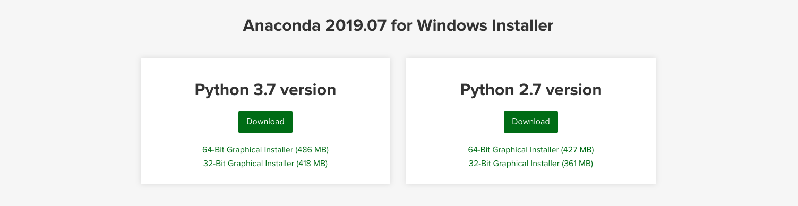
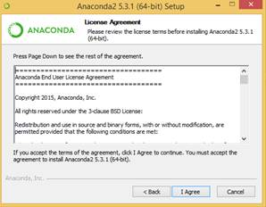
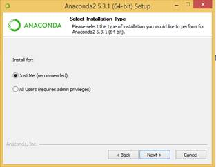
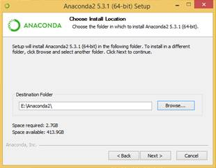
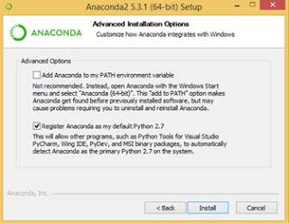
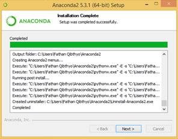
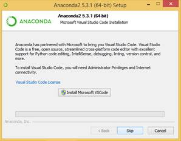
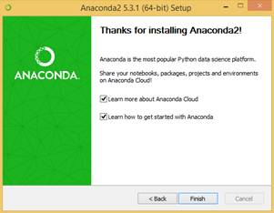
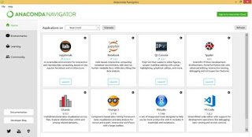

# Instalasi Anaconda

*Anaconda* adalah paket instalasi *Python* yang berisi semua yang dibutuhkan untuk keperluan pemrograman *data science*, matematika hingga teknik dalam satu paket distribusi *platform* yang *user friendly*. *File* instalasi *Anaconda* dapat diunduh [di sini](https://www.anaconda.com/distribution/).

## Langkah Instalasi

Kita dapat memilih menggunakan *Anaconda* dengan *package* *Python 2* atau *Python 3*. Selama *training* ini, kita mengunakan *Python versi 3*.

*File* instalasi *Anaconda* cukup besar, sekitar `486 MB` untuk versi *Windows 64 bit*-nya.  Setelah selesei diunduh, klik dua kali untuk memulai proses instalasi. Langkah selanjutnya:

1. Klik *Next* pada jendela dialog pertama. Pada tahap berikutnya, adalah *agreement*, klik *I Agree*.

    

2. Pada tahap berikutnya, kita diminta untuk memilih jenis instalasi apakah untuk semua pengguna komputer atau hanya kepada *user* yang menginstal. Jika *All Users* yang dipilih, diperlukan akses admin. Untuk itu, pilih *Just Me* saja lalu kilik *Next*.

    

3. Tentukan lokasi untuk menginstal *Anaconda*, lalu klik *Next*.

    

4. Lalu pada langkah *Advance Installation Options*, terdapat beberapa pilihan yaitu jika ingin menggunakan *Anaconda* melewati *command prompt (git bash, cmder, powershell, dll)* bisa centang di bagian *box* *“Add Anaconda to my Path eniroment variable”*. Artinya, ketika mencentang box tersebut, maka secara otomatis *Anaconda* akan membuat *“Path”* sendiri di *Environment Variables.* Jangan lupa centang *box* tersebut, lanjut klik *Install*.

    

5. Jika sudah selesai *(complete)* *install* pilih *next* dan akan muncul *Microsoft VSCode*, *skip* untuk melewati tahap ini karena kita sudah menginstal *VSCode*.

    

    

6. Gambar di bawah adalah tampilan jika instalasi sudah selesai dan bisa dilanjutkan dengan klik *finish*.

    

7. Langkah selanjutnya adalah mengecek apakah *Anaconda* sudah berhasil terinstal di komputer dengan cara mencari *Anaconda* di *Start Menu* untuk *windows*. *MacOs* atau *Linux skip* saja step ini.

    

8. Buka *Anaconda Prompt* *(windows)* atau *terminal* *(MacOs atau Linux)* dan coba untuk mengecek versi *Anaconda Python* yang dipakai.

    

9. Buka *Anaconda Navigator* untuk mengecek fitur–fitur atau aplikasi yang ada.

    
