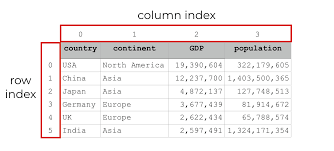
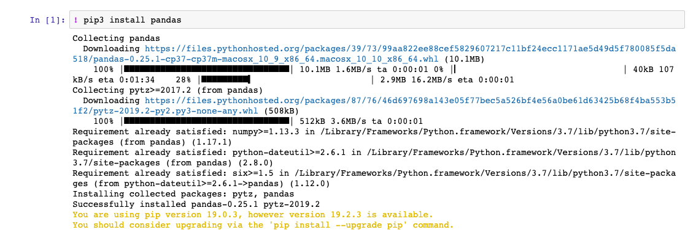

# Pandas

*Pandas* merupakan sebuah **eksternal *open source library* untuk *python* yang menyediakan banyak perkakas untuk kebutuhan analisis data, manipulasi, dan pembersihan data.**

*Pandas* mendukung **pembacaan dan penulisan data dengan media *file* berupa *excel spreadsheet, CSV,* dan *SQL*, yang kemudian akan dijadikan sebagai objek *python* dengan baris dan kolom yang disebut *data frame*** seperti yang ada pada tabel statistik. Biar lebih kebayang berikut adalah contoh *data frame* rekapitulasi suatu negara di *pandas*, serta nomor indeks dari kolom dan barisnya:



## Instalasi Pandas

*Pandas* secara *default* tidak tersedia pada modul standar disaat pertama kali instalasi *Python* (karena, *pandas* merupakan *3rd party / external library*.) dan kita diharuskan untuk melakukan instalasi terlebih dahulu sebelum menggunakannya.

Untuk melakukan instalasi *pandas*, kita membutuhkan koneksi internet. Selanjutnya, kita hanya cukup menggunakan `pip` *(windows)* atau `pip3` *(linux / macOS)* di dalam *jupyter notebook* sebagai berikut:

```py
! pip3 install pandas
```

Tampilannya instalasinya seperti ini:



Jika sudah ter-*install*, selanjutnya bisa kita *import* sepaket mulai dari *pandas* dan *numpy* sebagai *library* manipulasi datanya, serta *matplotlib* untuk membuat grafik, dengan menggunakan sintaks:

```py
import pandas as pd
import numpy as np
%matplotlib inline
```

*Matplotlib* adalah eksternal *library Python* yang memungkinkan kita untuk melakukan visualisasi terhadap data. Kita akan membahas *library* ini lebih dalam pada bagian visualisasi data nanti.
