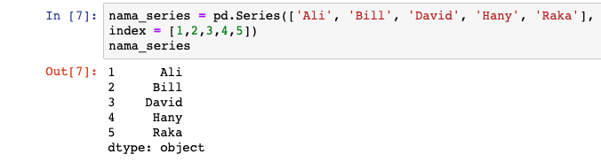
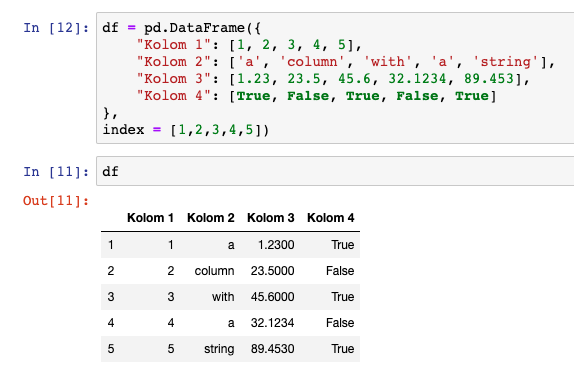
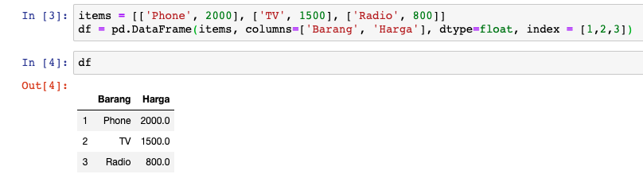
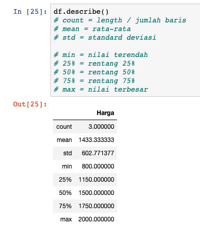
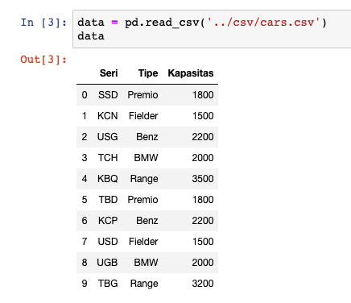
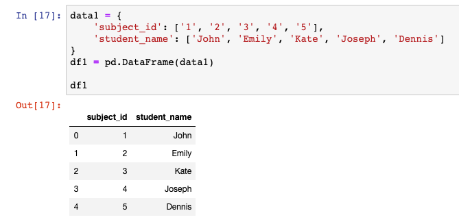
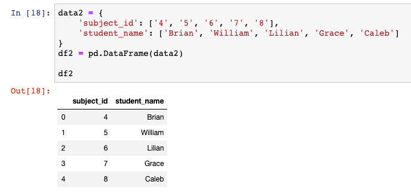
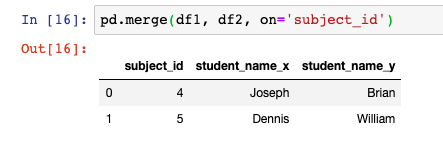
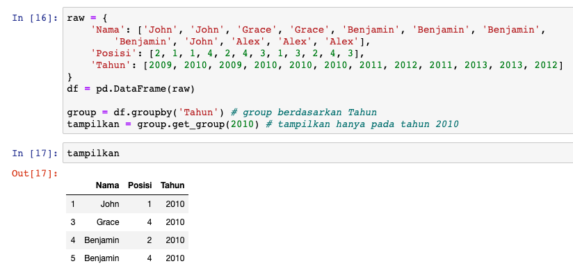
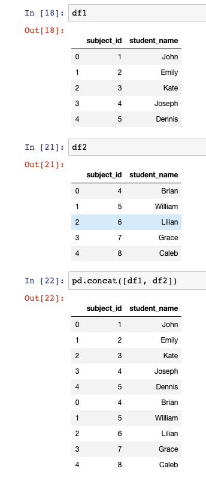

# Struktur Data Pandas

Seperti yang sudah kita bahas sebelumnya, *pandas* bisa membaca *data frame*, yang merupakan salah satu dari struktur data yang digunakan di *pandas*. Jadi, ada tiga jenis struktur data yang digunakan *pandas*, yaitu:

1. `Series` adalah struktur data 1D
1. `DataFrame` adalah struktur data 2D
1. `Panel` adalah struktur data 3D dan lebih (tidak dibahas karena jarang digunakan)

## Series

`Series` adalah **struktur data *pandas* yang menggunakan *array* satu dimensi (1D) yang serupa dengan kolom di dalam tabel**. Jika kita ingin membuat sebuah `Series` untuk daftar nama, kita dapat melakukannya seperti di bawah ini:

```py
nama_series = pd.Series(['Ali', 'Bill', 'David', 'Hany', 'Raka'],
index = [1,2,3,4,5]) # mengganti awal indeks menjadi 1 bukan 0
nama_series
```

*Jupyter notebook:*



Untuk membuat `Series` kita harus menggunakan perintah `pd.Series([])`, selanjutnya `index` digunakan untuk mengganti awalan indeks dimulai dari 1 bukan 0.

## DataFrame

### Cara Pertama

`DataFrame` adalah **struktur data seperti *array* dua dimensi (2D) yang disusun pada baris dan kolom berurut**. Jika dieksekusi, `DataFrame` berbentuk seperti sebuah tabel. Untuk membuatnya lebih jelas, mari lihat contoh pembuatan sebuah `DataFrame` berikut ini:

```py
df = pd.DataFrame({
    # kolom : baris
    "Kolom 1": [1, 2, 3, 4, 5],
    "Kolom 2": ['a', 'column', 'with', 'a', 'string'],
    "Kolom 3": [1.23, 23.5, 45.6, 32.1234, 89.453],
    "Kolom 4": [True, False, True, False, True]
},
index = [1,2,3,4,5])
```

*Jupyter notebook:*



> Baris adalah isi dari tabel, kolom adalah label tabelnya.

`pd.DataFrame([])` dibutuhkan untuk membuat suatu `DataFrame`. Format yang digunakan untuk `DataFrame` yang barusan kita buat adalah ***"key" :* *"value"*** atau **"kolom" : "baris"**. Di mana kolom 1-4 adalah *keys*, dan isinya adalah *values*.

Pada kolom pertama berisi *integer*, pada kolom ke dua berisi *string*, pada kolom ke tiga berisi *float*, dan kolom terakhir berisi *boolean*.

### Cara Ke dua

Kita juga bisa membuat `DataFrame` menggunakan *list* atau *array* dengan format yang lain. Kita cuma butuh memanggil `pd.DataFrame([])` dan menaruh *list* ke dalamnya. Berikut contohnya:

```py
items = [['Phone', 2000], ['TV', 1500], ['Radio', 800]]
df = pd.DataFrame(items, columns=['Barang', 'Harga'], dtype=float, index = [1,2,3])
df
```

*Jupyter notebook:*



Pada contoh di atas kita membuat variabel *list* dengan nama `items` dengan 3 baris isi. Untuk setiap barisnya, kita sudah mempunyai nama barang dan harganya. *List* dengan nama `items` kita jadikan isi dai parameter pertama `DataFrame()`, untuk dikonvert menjadi `DataFrame`.

Baris kode `df = pd.DataFrame(items, columns=['Barang', 'Harga'], dtype=float)`, penjelasannya adalah:

1. `df` adalah variabel penampung `DataFrame`
2. `items` adalah *list* yang mau dikonvert
3. `columns=['Barang', 'Harga']` adalah nama kolom atau *header*. Kita menggunakan `columns=[]` di bagian parameter `DataFrame()` untuk membuat kolom baru.
4. `dtype=float` adalah tipe data yang digunakan, yaitu tipe data *float*

### Melihat Deskripsi dari DataFrame

Untuk mendapatkan deskripsi singkat dari `DataFrame` kolom harga, kita bisa menggunakan fungsi `describe()`:

```py
df.describe()
```

*Jupyter notebook:*



Fungsi `describe()` mengembalikan semua data yang umum digunakan dalam statistik, diantaranya *mean*, *stardard deviation*, *minimum*, *maximum*, dan data-data statistik lainnya, dalam tipe data *float*.

## Mengimport Data

Kita akan sering meng-*import* *file* dari luar yang berformat *Excel* ataupun *CSV*. Kita bisa meng-*import* dan membuka data dari sumber-sumber tersebut menggunakan *pandas*, menjadi `DataFrame`.

### Mengimport File .CSV

Sebagai contoh, kita akan membuat sebuah *file CSV* dengan nama **cars.csv**. *File* tersebut berisi:

```csv
Seri,Tipe,Kapasitas
SSD,Premio,1800
KCN,Fielder,1500
USG,Benz,2200
TCH,BMW,2000
KBQ,Range,3500
TBD,Premio,1800
KCP,Benz,2200
USD,Fielder,1500
UGB,BMW,2000
TBG,Range,3200
```

Teman-teman bisa meng-*copy* dan *paste* di *text editor* seperti *notepad*, dan *save* dengan nama **cars.csv** di *folder* yang sama dengan kode *Python* teman-teman, atau bisa di-*download* lewat [github](https://github.com/Fauzan-affan/intro-python-for-data-science.git) ada di dalam `day 10 > csv > cars.csv`.

`pandas` menyediakan fungsi `read_csv` yang bisa digunakan untuk membaca *file* dengan format CSV. Caranya adalah sebagai berikut:

```py
data = pd.read_csv('../csv/cars.csv')
data
```

*Jupyter notebook:*



Pada kasus kali ini, saya menyimpan *file*-nya di *folder* berbeda, yang ada di luar dari *folder* sekarang. Jika teman-teman menaruh pada *folder* yang sama, kita bisa mengganti *path*-nya menjadi `pd.read_csv(cars.csv)` saja.

### Menampilkan 5 Baris Teratas

Jika kita berhadapan dengan ribuan baris data, dan kita hanya ingin menampilkan lima baris teratas saja dibandingkan harus menampilkan ribuan data tersebut, `pandas` menyediakan fungsi `head()` untuk memfasilitasi itu:

```py
data.head()
```

*Jupyter notebook:*


### Menampilkan Baris Tertentu

`loc()` *method* berguna untuk menampilkan spesifik baris tertentu saja. Contohnya sebagai berikut:

```py
data.loc[[0, 4, 7], ['Tipe']]
# 0, 4, dan 7 adalah indeks
# Tipe adalah nama kolom
```

*Jupyter notebook:*


Nah, di sini kita menggunakan `loc()` *method* untuk menampilkan hanya indeks 0, 4, dan 7 saja dari kolom `Tipe`. Kita juga bisa menampilkan semua baris dari kolom tertentu saja dengan menggunakan '`:`' (titik dua) pada parameter pertamanya:

```py
data.loc[:, ['Tipe', 'Kapasitas']]
```

*Jupyter notebook:*


Kode di atas berarti menampilkan semua baris yang berada pada kolom tipe dan kapasitas.

### Mengimport File .xlsx

Selain menggunakan `read_csv` untuk membaca *file* CSV, *pandas* juga menyediakan `read_excel` untuk membaca *file excel*. Cara penggunaanya sama persis seperti membaca *file* CSV, yang membedakan hanya mengganti `read_csv` menjadi `read_excel` saja. Contohnya sebagai berikut:

```py
data = pd.read_excel('nama_file.xlsx')
data
```

## Persiapan Data

Suatu proses yang dilakukan untuk mempersiapkan data yang akan digunakan pada step berikutnya. Contoh yang sering dilakukan dalam persiapan data adalah *merging*, *grouping*, dan *concatination*. Bagian dari manipulasi data ini sangat penting di *data science*, karena **tujuannya untuk mendapatkan data yang pas dan tepat dengan kebutuhan analisis, sehingga apapun analisis yang dilakukan dapat berjalan dengan baik.**

### Merging

*Library pandas* memungkinkan kita **menggabungkan `DataFrame` menggunakan fungsi `merge()`**. Pertama kita buat dulu dua buah `dataFrame` yang berbeda.

Ini adalah `DataFrame` yang pertama yaitu `df1`:

```py
data1 = {
    'subject_id': ['1', '2', '3', '4', '5'],
    'student_name': ['John', 'Emily', 'Kate', 'Joseph', 'Dennis']
}
df1 = pd.DataFrame(data1)

df1
```

*Jupyter notebook:*



Ini adalah `DataFrame` yang ke dua yaitu `df2`:

```py
data2 = {
    'subject_id': ['4', '5', '6', '7', '8'],
    'student_name': ['Brian', 'William', 'Lilian', 'Grace', 'Caleb']
}
df2 = pd.DataFrame(data2)

df2
```

*Jupyter notebook:*



Selanjutnya kita gabungkan berdasarkan *value* yang sama dari `subject_id`, seperti ini:

```py
pd.merge(df1, df2, on='subject_id')
```

*Jupyter notebook:*



Kalau kita perhatikan hasilnya, `subject_id` yang *value*-nya sama hanya 4 dan 5 saja.

Banyak banget cara buat menggunakan si `pd.merge()` yang tidak kita bahas di sini, untuk contoh yang lebih banyak teman-teman bisa lihat di [sini.](https://pandas.pydata.org/pandas-docs/stable/reference/api/pandas.DataFrame.merge.html)

### Grouping

*Grouping* adalah **proses menampilkan data tertentu berdasarkan suatu kategori**. Contoh, misalkan kita mau menampilkan semua data berdasarkan tahun seperti kode di bawah ini:

```py
raw = {
    'Nama': ['John', 'John', 'Grace', 'Grace', 'Benjamin', 'Benjamin', 'Benjamin',
        'Benjamin', 'John', 'Alex', 'Alex', 'Alex'],
    'Posisi': [2, 1, 1, 4, 2, 4, 3, 1, 3, 2, 4, 3],
    'Tahun': [2009, 2010, 2009, 2010, 2010, 2010, 2011, 2012, 2011, 2013, 2013, 2012]
}
df = pd.DataFrame(raw)

group = df.groupby('Tahun') # group berdasarkan Tahun
tampilkan = group.get_group(2010) # tampilkan hanya pada tahun 2010

tampilkan
```

*Jupyter notebook:*



### Concatenation

*Concatenation* adalah **menambahkan** satu `DataFrame` ke `DataFrame` yang lain. `pandas` menyediakan fungsi `concat()` untuk melakukan penggabungan `DataFrame` tersebut.

Misalkan kita mau menggabungkan ke dua `DataFrame` yang sudah kita gunakan sebelumnya, yaitu `df1` dan `df2`:

```py
# melihat isi df1
df1

# melihat isi df2
df2

# gabungkan dengan menggunakan concat()
pd.concat([df1, df2])
```

*Jupyter notebook:*


