# DataFrame Subsets

Kadang kita hanya ingin bekerja dengan beberapa kolom tertentu saja di `DataFrame`. Untuk itu kita akan membuang beberapa kolom yang tidak perlu. **Baris dan kolom yang ingin kita gunakan** inilah yang kita sebut dengan *subsets*. *Pandas* memfasilitasi kita banyak cara untuk melakukan itu semua. Sekarang kita akan mencoba membuat *subsets* menggunakan contoh kasus di bawah ini.

## Data Nama-Nama Bayi di Amerika

Mari kita coba lakukan **analisis sederhana** terhadap data [nama bayi yang lahir di Amerika dari tahun 1880 - 2009](https://github.com/Fauzan-affan/data-baby-names) berikut ini:

```py
import pandas as pd
names = pd.read_csv('../csv/baby-names.csv')
names
```

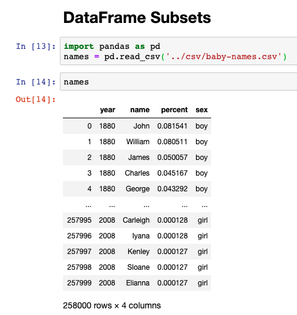

Kode di atas adalah perintah untuk meng-*import* data csv, yang kemudian kita tampung ke dalam variabel dengan nama `names`.

Dari hasil di atas kita dapat melihat bahwa data ini **memiliki 258.000 baris, yang memiliki  4  kolom  *(year,  name,  percent,  sex)*.**

### Fungsi head()

Mari kita lihat beberapa baris pertama dari data kita:

```py
names.head()
```

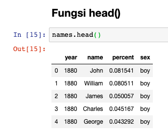

Fungsi ***head*** dapat dimasukkan parameter jumlah baris pertama yang akan kita tampilkan, misal kita ingin menampilkan 12 baris pertama dari data:

```py
names.head(12)
```

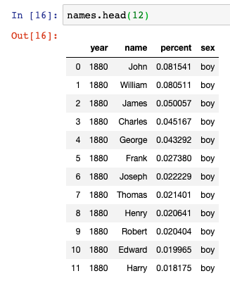

### Fungsi tail()

Kebalikan dari *head*, *tail* menampilkan data dari belakang:

```py
names.tail()
```

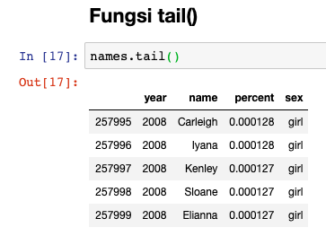

Fungsi *tail* juga bisa kita tambahkan parameter di dalamnya:

```py
names.tail(12)
```

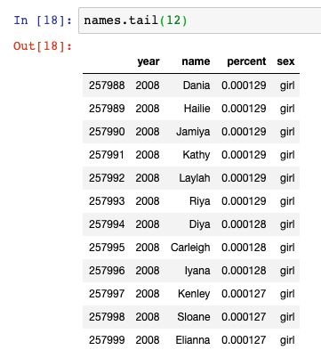

### Slicing

**Kita bisa memilih rentang data secara spesifik baris atau kolom yang kita mau**, menggunakan label kolom ataupun indeks *integer*. Proses memilih inilah yang kita sebut dengan *slicing*. Ada beberapa cara untuk melakukan *slicing*, yaitu **berdasarkan baris**, **berdasarkan baris dan kolom**, dan **berdasarkan kriteria yang ada pada data**.

#### Slicing Berdasarkan Baris

*Slicing* menggunakan `[]`, dapat memilih baris di dalam `DataFrame`. Untuk memilih baris kita bisa menggunakan sintaks:

```py
data[mulai:selesai]
```

Pada saat menggunakan sintaks di atas, `mulai` berarti mulai dari mana baris yang mau kita ambil (berdasarkan indeks). `selesai` berisi satu angka yang lebih besar dari baris yang mau kita tetapkan sebagai akhir dari *output*. Jadi kalau kita mau **memilih baris 0, 1, dan 2** kodenya akan menjadi seperti berikut:

```py
names[0:3]
```

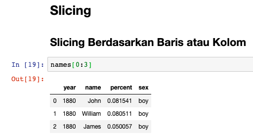

Memilih semua baris (berdasarkan indeks) sebelum indeks ke 5:

```py
names[:5]
```

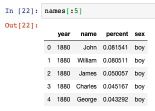

Memilih **mulai dari baris terakhir (menggunakan minus)** sampai indeks tertentu yang ditetapkan:

```py
# Select the last element in the list
# (the slice starts at the last element, and ends at the end of the list)
names[-5:]
```

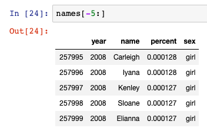

#### Slicing Berdasarkan Baris dan Kolom

Kita bisa memilih spesifik baris dan kolom baik berdasarkan label atau indeks. Ada dua fungsi yang disediakan *pandas*:

1. `iloc` berdasarkan indeks, artinya hanya bisa *integer*. **Kolomnya juga diurutkan berdasarkan indeks.** Sintaksnya sebagai berikut:

    ```py
    iloc[baris,kolom]
    ```

2. `loc` berdasarkan label. **Bisa saja menggunakan indeks (integer) tapi dianggapnya sebagai label**. Sintaksnya sebagai berikut:

    ```py
    loc[baris,kolom]
    ```

Contoh misalkan kita mau **mencari baris 0 - 5, dari kolom *name* dan *sex*** seperti berikut:

```py
# iloc
names.iloc[0:5,[1,3]]
```

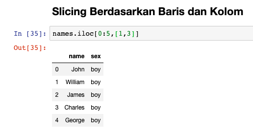

```py
# loc
names.loc[0:5,['name','sex']]
```

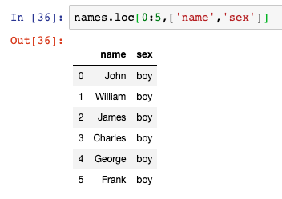

> label di `loc` harus ada di `DataFrame`, atau *jupyter* akan mengembalikan `KeyError`.

Kita juga bisa menampilkan semua kolom menggunakan `:` (titik dua) di `loc` maupun `iloc`.

#### Slicing Berdasarkan Kriteria

Kita juga bisa memilih *subsets* yang kita mau **berdasarkan suatu kriteria atau kondisi**. Sintaksnya sebagai berikut:

```py
data[data.kolom == value]
```

`==` bisa diganti dengan operator lainnya, sesuai kondisi yang mau kita dapatkan. Sebagai contoh kita bisa **memilih semua baris yang tahunnya 2000**:

```py
names[names.year == 2000]
```

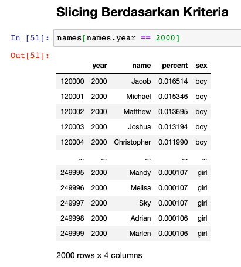

Kita juga bisa menambahkan lebih dari satu kriteria seperti berikut:

```py
names[(names.year >= 2000) & (names.year <= 2005)]
```

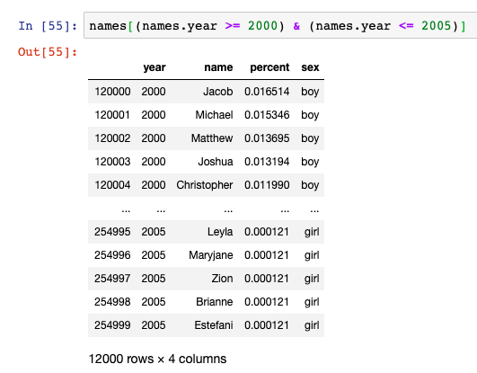

Modul *Pandas* memungkinkan kita membuat *subsets* baru dengan sangat mudah. Misalkan, kita ingin memisahkan *subsets* berdasarkan nama bayi laki-laki dan perempuan.

Pisahkan bayi perempuan untuk kita tampung ke dalam variabel `girl_names`, dan bayi laki-laki ke dalam `boy_names` dengan menggunakan kriteria sebagai berikut:

```py
girl_names = names[names['sex'] == 'girl']
boy_names = names[names['sex'] == 'boy']
```

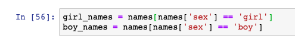

Atau jika kita ingin mencoba yang lebih kompleks. Karena, biasanya yang bernama *William* adalah laki-laki. Kita bisa mencari anak yang namanya ***William*** saja, berdasarkan *subsets* `boy_names`.

```py
boy_names[boy_names['name'] == 'William']
```

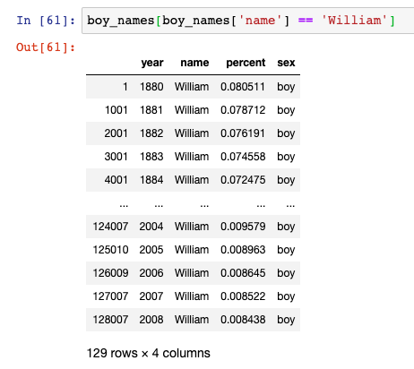

Menampilkan **hanya kolom *year* dan *percent*** pada data anak yang bernama *William* saja:

```py
# Bungkus ke dalam variabel william
william = boy_names[boy_names['name'] == 'William']

# slicing menggunakan loc
william.loc[:,['year','percent']]
```

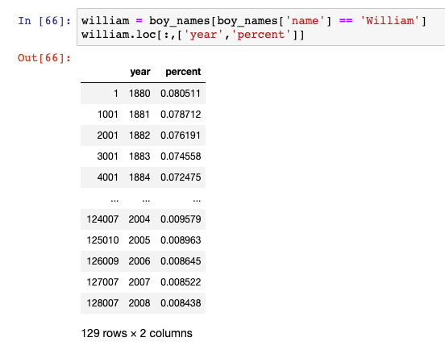

#### Menggunakan Kolom Sebagai Indeks

Kita juga bisa menggunakan **kolom yang ada di *subset* menjadi indeks** menggunakan fungsi **`set_index`**. Contoh kita ingin menggunakan *year* pada *subset* `year_indeks` sebagai indeks:

```py
# Bungkus ke dalam year_indeks
year_indeks = william.loc[:,['year','percent']]

# rubah kolom year menjadi indeks
year_indeks.set_index(['year'])
```

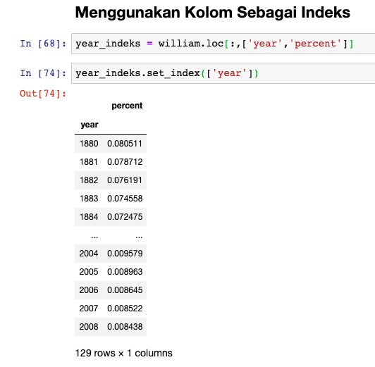
