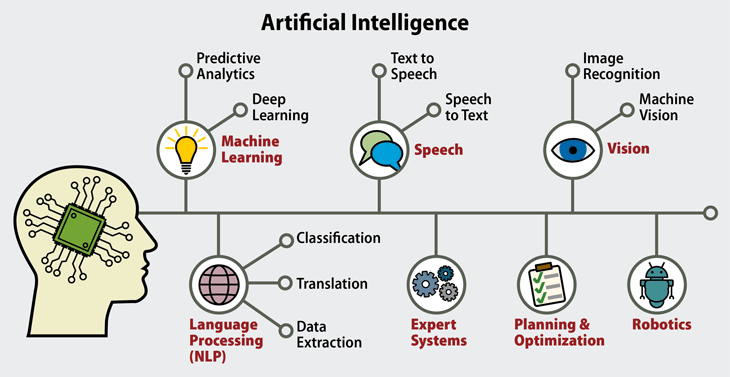
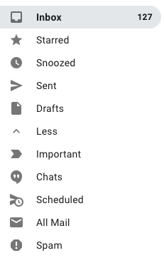
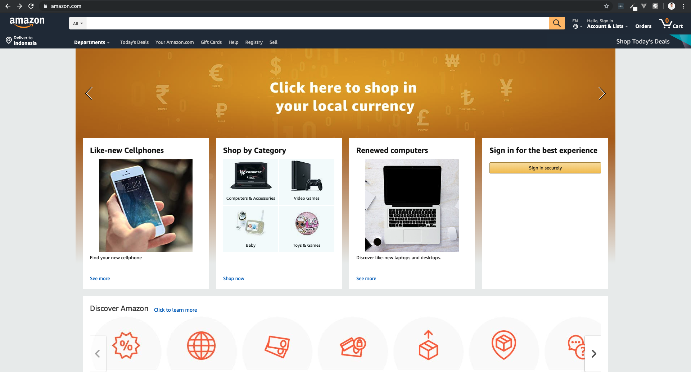

# Perkenalan Machine Learning

## Perbedaan Data Engineer, Data Analyst, dan Data Scientist

### Data Engineer

**Uraian pekerjaan:** *Data engineer* akan mengelola jalur pipa *(pipeline)* data untuk perusahaan yang menangani volume data besar. Itu berarti **memastikan bahwa data tidak ada masalah saat sedang dikumpulkan dan diambil secara efisien (cepat) dari sumbernya ketika dibutuhkan, dibersihkan, dan diproses**.

> Ibaratkan data adalah air, maka *data engineer* **memastikan aliran air yang besar lancar sampai ke pengguna** ketika melewati pipa yang dikontrol oleh *data engineer*.

**Mengapa *data engineer* penting:** Jika kita hanya pernah bekerja dengan set data yang relatif kecil (kurang dari 5 GB) dalam file .csv atau .xlsx, mungkin kita akan sulit untuk memahami mengapa ada orang yang mempunyai pekerjaan untuk memelihara *pipeline*.

Berikut beberapa alasannya:

Data 50 GB tidak muat di RAM (yang membaca data) komputer, jadi *data engineer* biasanya perlu cara lain untuk memasukkan data ke dalam model yang *data scientist* buat.

Nah, banyak data bisa membutuhkan banyak waktu untuk diproses dan **sering kali harus disimpan berkali-kali**. **Mengelola penyimpanan itu membutuhkan pengetahuan teknik khusus.**

**Persyaratan:** Teknologi yang digunakan termasuk *Apache Spark*, *Hadoop* dan/atau *Hive*, serta *Kafka*. Kemungkinan besar *data engineer* juga harus memiliki dasar yang kuat dalam SQL.

**Pertanyaan yang akan *data engineer* hadapi:**

- Bagaimana cara membangun *pipeline* yang dapat menangani 10.000 permintaan data per menit?
- Bagaimana saya *(data scientist)* bisa membersihkan set data ini tanpa memuat semuanya dalam RAM?

### Data Analyst

**Uraian pekerjaan:** Pekerjaan *data analyst* adalah **menerjemahkan data menjadi suatu yang berkaitan dengan bisnis dan dapat di gunakan dalam proses bisnis tersebut**. *Data analyst* akan sering menjadi perantara untuk tim teknis dan strategi bisnis, tim penjualan, atau tim pemasaran biasanya. **Visualisasi data** akan menjadi pekerjaan yang menghabiskan sebagian besar hari-hari seorang *data analyst*.

**Mengapa *data analyst* penting:** *Data analyst* harus mengubah **model** dan **sekumpulan data pengguna yang sudah teruji** dan **terlatih** ke dalam format yang dapat dicerna, sehingga strategi bisnis dapat dirancang di sekitarnya.

> *Data analyst* membantu memastikan bahwa tim *data science* tidak membuang waktu untuk menyelesaikan masalah yang tak punya nilai bisnis.

**Persyaratan:** Teknologi yang digunakan termasuk *Python, SQL, Tableau,* dan *Excel*. *Data analyst* juga harus menjadi seorang komunikator yang baik.

**Pertanyaan yang akan *data analyst* hadapi:**

- Faktor apa yang mendorong angka pertumbuhan (pendapatan / pengguna / vendor) kami?
- Bagaimana cara kami menjelaskan kepada manajemen, bahwa kenaikan biaya pengguna (aplikasi) baru-baru ini membuat orang menjauh?

### Data Scientist

**Uraian pekerjaan:** Pekerjaan *data scientist* adalah **membersihkan dan menjelajahi kumpulan data**, dan **membuat prediksi** yang bisa menghasilkan nilai bisnis. Keseharian *data scientist* akan selalu melakukan **pelatihan dan optimalisasi model** dan sering kali ditempatkan dalam proses produksi *(product division)*.

**Mengapa *data scientist* penting:** Ketika kita memiliki setumpuk data yang jumlahnya sangat besar untuk diurai oleh manusia dan terlalu berharga untuk diabaikan, kita **perlu cara untuk mencari informasi penting yang dapat dicerna** dari data tersebut. Itulah tugas dasar seorang *data scientist:* mengubah kumpulan data menjadi kesimpulan yang dapat dicerna menggunakan *tools* tertentu.

**Persyaratan:** Teknologi yang digunakan termasuk *Phyton, scikit-learn, Pandas, SQL,* dan mungkin *Flask*, *Spark/Kafka* dan/atau *TensorFlow/PyTorch*. Beberapa posisi *data scientist* murni bersifat teknis, tapi kebanyakan akan menuntut kita untuk **mengerti bisnis di perusahaan** tersebut juga.

**Pertanyaan yang akan *data scientist* hadapi:**

- Berapa banyak jenis pengguna yang benar-benar kita miliki? (memisahkan *fake account* dan *real account*)
- Bisakah kita membuat model untuk memprediksi produk mana yang akan dijual, dan untuk pengguna yang mana?

## Machine Learning

*Machine learning* merupakan cabang dari AI *(Artificial Intelligence)* atau kecerdasan buatan, khususnya yang mempelajari tentang **bagaimana komputer dapat belajar dari data untuk meningkatkan kecerdasannya.** Pada dasarnya isi dari *machine learning* ini adalah kumpulan algoritma yang dirangkai dari metode-metode statistik.

***Data Scientist*** seringkali menggunakan beberapa algoritma *machine learning* untuk mengungkap pola-pola yang tersembunyi dalam rangka mendapatkan *insigth* atau informasi dari suatu data.

Pada level analisis yang tinggi, beberapa algoritma tersebut **secara garis besar dapat dibagi menjadi 2 bagian** berdasarkan bagaimana mesin tersebut belajar yaitu ***supervised learning*** dan ***unsupervised learning***.

## Penerapan Machine Learning di Dunia Nyata

*Machine Learning* akan mempelajari pola data yang ada untuk menghasilkan sebuah prediksi.

### Email Spam atau Bukan

Contoh yang paling dekat dengan kita yaitu **pengkategorian *email*.**

*Provider email* (contohnya *Gmail*) dapat memprediksi *email* masuk, **apakah termasuk ke dalam kategori *spam* atau bukan**. Dalam penentuan *email* tersebut sebenarnya ada *machine learning* yang bekerja di bekalangnya. ***Machine learning* mempelajari pola dari pengirim *email*, isi *email*, *subject email*, dsb untuk menentukan apakah *email* tersebut termasuk *spam* atau bukan**. Pola tersebut dipelajari dari data-data lain terkait *email* tersebut atau *email* yang ada pada *inbox email*, yang mana hasil dari mempelajari pola tersebut menghasilkan sebuah prediksi, *email* tersebut *spam* atau bukan.

### Menentukan Sasaran Pasar

*Machine learning* juga diterapkan di banyak *e-commerce* di dunia.

Contohnya *Amazon* **memprediksi belanjaan yang sering dibeli para *customer*-nya**. Sehingga, ketika *Amazon* memiliki produk baru, mereka tau **ke mana target pasar yang tepat untuk mempromosikan produk baru** mereka.

### Kemudi Otomatis

Bahkan, pada *zaman now*, AI juga sudah diterapkan pada kemudi otomatis di mobil. Tentunya, yang terdapat *machine learning* juga di dalamnya.

Peran *machine learning* **menyebabkan mobil yang kita tumpangi bisa mendeteksi jalan yang dilewati, tanpa harus ada orang yang mengemudikan mobil tersebut**. Bahkan salah satu perusahaan mobil ternama menerapkan fitur **parkir otomatis** pada mobilnya.

## Conclusion

Sebagai *data scientist*, kita dituntut untuk memperdiksi sesuatu yang menghasilkan nilai bisnis. Maka *machine learning* yang kita pelajari sekarang akan membahas **bagaimana caranya membuat model dari data-data yang kita punya**, mulai dari mengambil data yang dibutuhkan dan menghilangkan yang tidak dibutuhkan, mencari nilai statistika dari kumpulan data tersebut, memilih algoritma yang tepat untuk data yang kita punya, hingga mengukur tingkat akurasi model yang kita punya nanti.
