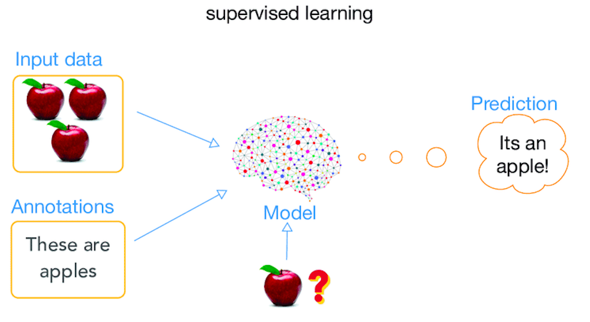
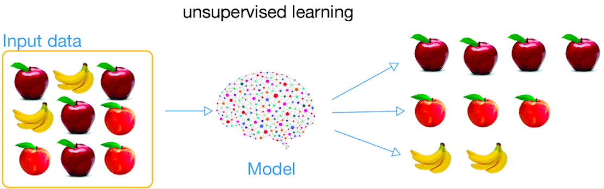

# Tipe-Tipe Machine Learning

*Machine learning* membutuhkan algoritma yang tepat untuk bisa memprediksi bahkan meningkatkan efektivitas dari suatu model yang kita buat. **Ada dua kategori *machine learning*, yang pertama *supervised machine learning* dan yang ke dua *unsupervised machine learning***. Perbedaan ke dua algorima tersebut terletak pada **bagaimana model belajar untuk membuat suatu prediksi maupun klasifikasi**.

## Supervised Machine Learning



Pendekatan *supervised learning* **mempunyai *input* dan *output* yang dapat dibuat menjadi suatu model hubungan matematis sehingga mampu melakukan prediksi dan klasifikasi berdasarkan data yang telah ada sebelumnya**.

Mari ambil contoh di mana kita adalah seorang ***real estate agent*** dan kita menyewa seorang *data scientist* *(trainer)* untuk membantu bisnis kita berkembang. Untuk membantu *trainer* memprediksi harga rumah, kita membuat data penjualan rumah untuk *trainer*. Dan yang paling penting, **kita menulis harga final rumahnya** pada data yang ada. **Data penjualan rumah ini kita sebut dengan data latih *(training data)*.**

|Jumlah Kamar|Luas (M2)|Tempat|Harga (USD)|
|---|---|---|---|
3|200|Jatinegara|150.000|
2|100|Bintaro|300.000|
2|150|Kelapa Gading|250.000|
1|250|Jatinegara|50.000|
4|100|Bintaro|450.000|
2|100|Kelapa Gading|250.000|

Timbul pertanyaan harga rumah dengan kriteria berbeda dengan data di atas:

|Jumlah Kamar|Luas (M2)|Tempat|Harga (USD)|
|---|---|---|---|
1|100|Jatinegara|???|

**Dari data penjualan rumah yang kita gabungkan dengan *machine learning*, terbentuklah model.** Kita bisa menjawab tanda tanya tersebut dengan model yang dapat memberikan estimasi harga suatu rumah yang kriterianya berbeda dari data yang ada.

Kesimpulannya adalah ***supervised learning* menggunakan data latih *(training data)* dalam melakukan prediksi maupun klasifikasi**. Banyak sekali algoritma *supervised learning*. Beberapa algoritma yang termasuk dalam *supervised learning* diantaranya:

- Regresi Linier
- Regresi Logistik
- *Nearest Neighbor Classifier*
- *Naive Bayes Classifier*
- CART *(Classification and Regression Trees)*
- *Artificial Neural Network*
- *Support Vector Machine*

Dalam bentuk matematis, *supervised learning* dapat dituliskan:

```py
Y = f(x)
```

Di mana:

- `Y` adalah target variabel yang diharapkan / variabel yang dipengaruhi / dependent (tanda tanya yang tadi)
- `x` adalah *training data* yang digunakan untuk mencari `Y` / variabel yang mempengaruhi / independent (data penjualan rumah)
- `f()` adalah fungsi atau model

## Unsupervised Machine Learning



Pendekatan *unsupervised learning* ini hanya mempunyai *input* yaitu *training data*-nya saja. Model matematisnya **tidak memiliki target variabel yang diharapkan** (`Y`).

Salah satu tujuan dari *unsupervised learning* ini adalah **mengelompokkan objek yang hampir sama dalam suatu area tertentu**.

Mari kita ambil contoh yang sama seperti kasus *supervised learning*, ***real estate agent***. Bagaimana kalau kita tidak tau harga jual tiap rumah?

|Jumlah Kamar|Luas (M2)|Tempat|
|---|---|---|
3|200|Jatinegara|
2|100|Bintaro|
2|150|Kelapa Gading|
1|250|Jatinegara|
4|100|Bintaro|
2|100|Kelapa Gading|

Apa yang bisa kita lakukan dengan data di atas? Kita bisa membuat algoritma yang secara otomatis **mengidentifikasi segmen pasar** dari data tersebut. Mungkin saja, nanti kita bisa menemukan bahwa **pembeli di sekitar kampus lebih suka rumah yang kecil dengan jumlah kamar yang banyak, tapi pembeli di kota lebih memilih rumah 3 kamar dengan tanah yang luas, dan lain sebagainya**.

Beberapa algoritma yang dapat digunakan dalam *unsupervised learning* adalah:

- PCA *(Principal Component Analysis)*
- *K-Means*
- *Apriori*
- *Hierarchical Clustering*
- DBSCAN *(Density-Based Spatial Clustering of Applications with Noise)*
- *Fuzzy C-Means*
- *Self-Organizing Map*

Dalam bentuk matematis, *unsupervised learning* dapat dituliskan:

```py
f(x)
```

Di mana:

- `x` adalah *training data* yang akan dikelompokkan / variabel yang mempengaruhi / independent (data rumah tanpa harga jual)
- `f()` adalah fungsi atau model

## Membedakan Supervised dan Unsupervised

Cara yang paling mudah untuk membedakan ke dua kategori *machine learning* ini, yaitu jika kita **memiliki target variabel** (`Y`) maka kita dapat menggunakan pendekatan **supervised learning**. Sedangkan **jika tidak**, maka kita dapat menggunakan **unsupervised learning**.
