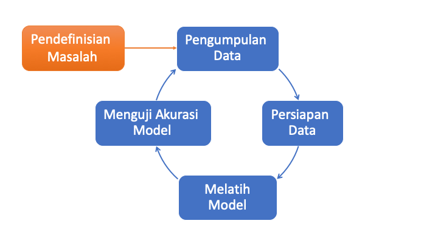

# Alur Machine Learning

Membangun *machine learning* adalah serangkaian tugas yang kompleks. Selama bertahun-tahun, alur kerja *machine learning* telah dikembangkan untuk mengatur rangkaian *machine learning* secara efisien dan memastikan bahwa tidak ada langkah penting yang terlewatkan.

Alur *machine learning* pada dasarnya adalah **suatu pola yang diatur dan diulang, dengan tujuan merubah dan mengolah data menjadi informasi secara sistematis untuk menghasilkan prediksi**.

Biasanya seorang *data scientist* akan membagi alur *machine learning* menjadi beberapa bagian, yaitu:

1. Pengumpulan Data
2. Persiapan Data
3. Melatih Model
4. Menguji Akurasi Model

> Jika proses sudah sampai di menguji akurasi model namun dirasa **model masih belum maksimal**, kita bisa mengulangnya kembali mulai dari pengumpulan data, dan begitu seterusnya hingga model yang kita mau berhasil dibuat. Proses mengulang untuk memaksimalkan model ini lah yang disebut optimasi model.

Untuk merubah informasi yang telah diolah ke bentuk diagram dan disajikan, teman-teman juga bisa menggunakan visualisasi data yang akan kita bahas nanti. Biasanya visualisasi data akan dilakukan oleh seorang *data analyst*, untuk memudahkan manajement mencerna hasil dari model.

Ada beberapa catatan penting yang harus teman-teman perhatikan dalam penerapan *machine learning* ini:

1. **Langkah awal penting**
    Langkah-langkah selanjutnya ditentukan oleh langkah sebelumnya. Artinya, langkah selanjutnya tidak bisa dilakukan jika langkah sebelumnya belum selesai *(procedural)*.

2. **Mengulang proses**
    Pemrosesan data biasanya tidak hanya selesai di pemrosesan pertama saja. Untuk mendapatkan hasil yang maksimal, seorang *data scientist* akan terus mengulang percobaan terhadap modelnya menggunakan algoritma *machine learning* lainnya.

3. **Data berantakan**
    Biasanya data yang digunakan untuk percobaan model masih belum sesuai dengan yang kita inginkan. Untuk itu, kita perlu mengeksplorasi data tersebut sebelum bisa kita gunakan untuk pemodelan.

4. **Semakin banyak data, semakin bagus**
    Makin banyak data yang digunakan untuk pemodelan, makin akurat hasil yang didapatkan.
