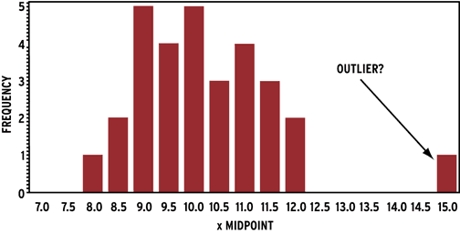
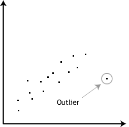

# Statistika Dasar

Sebelum kita masuk ke materi selanjutnya, sejujurnya *data scient* adalah sebuah penerapan statistika menggunakan bahasa pemrograman sebagai *tools*-nya. Lalu, apa sih yang dinamakan **statistika** dan bedanya dengan **statistik**?

* **Statistika** adalah suatu ilmu yang mempelajari tentang cara pengumpulan data, penyajian data, analisis data, dan penjelasan tentang data tersebut.

* **Statistik** adalah data, informasi, atau hasil dari penerapan algoritma statistika pada suatu data.

Banyak yang menganggap statistika itu sulit, padahal sebenarnya tidak. Kenapa tidak? Karena statistika itu bukannya sulit, tetapi ***buanyaak*** sekali metodenya, sehingga membingungkan pada saat menentukan metode statistika apa yang cocok diterapkan pada kasus atau permasalahan yang kita punya. Ngomong-ngomong tentang pemilihan metode yang tepat, **kita harus tau dan pahami dulu, apa tujuan dari statistika yang mau kita lakukan?** Jika dilihat dari alur *data scient* sebelumnya, tahapan ini masuk pada **pendefinisian masalah**.

Nah, secara garis besar metode yang digunakan dalam statistika ada 2, yaitu:

## 1. Statistika Deskriptif

Statistika deskriptif adalah peringkasan dan pengorganisasian data sehingga mudah untuk dipahami. Statistik deskriptif, tidak sama seperti statistik inferensial. Karena, **statistika deskriptif hanya berupaya menggambarkan atau mendeskripsikan data, tetapi tidak menarik kesimpulan dari sampel data tersebut**. Biasanya statistika deskriptif **hanya menggambarkan** data dalam sampel yang diambil dari suatu populasi.

Analisis statistik deskriptif membantu dalam memahami data dan merupakan bagian yang sangat penting dari proses ML (Machine Learning) . Ini karena ML kadang kala akan **membuat prediksi** dari sampel data yang kita punya. Selain itu, ML berhubungan juga dengan **menarik kesimpulan** atau **mengelompokkan data** dari sampel data yang kita punya. Kita akan membahas tentang konsep statistik deskriptif yang akan membantu memahami dengan lebih baik apa yang ingin disampaikan oleh data kita, hingga menghasilkan model ML. Bisa dikatakan, ini adalah statistika dasar yang wajib dikuasai oleh setiap orang yang bekerja dengan data.

Manfaat statistika deskriptif ada banyak sekali, tetapi yang perlu kita garis bawahi ada 2, yaitu:

1. Memberikan gambaran atau deskripsi dari data yang kita punya

2. Menjelaskan karakteristik sebuah data (mean, median, modus, dll)

### 1.1 Populasi & Sampel

Di dalam statistik, **populasi umunya adalah semua data yang mau kita analisis.** Populasi cakupannya sangat luas, seringkali *data scientist* tidak bisa mengumpulkan seluruhnya apalagi menganalisanya. Nah, karenanya biasanya beberapa ahli statistik mencoba membuat beberapa kesimpulan tentang suatu populasi dengan memilih dan memeriksa bagian yang mewakili dari populasi tersebut.

**Sebagian dari populasi ini kita sebut dengan sampel.** Idealnya, sampel harus mempunyai fitur statistik penting dari populasi yang bisa digunakan untuk analisa. Dengan bagitu, kita bisa menggunakan sampel untuk mendapatkan kesimpulan dari populasi.

### 1.2 Outliers

***Outlier*** adalah **titik data yang menyimpang terlalu jauh dari mayoritas data yang lain, yang diambil dari sampel atau populasi.** Contoh:

Ada beberapa faktor penyebab *outlier,* diantaranya:

1. Variasi alami dari datanya

    Contoh data tinggi manusia (cm) terdiri dari 180, 185, 177, 0, 0, 145. Nah, 145cm ini jika dibuat grafik akan terlihat menjadi *outlier.*

2. Perubahan prilaku data yang diamati

    Bisa saja ketika kita mengamati suatu data yang sifatnya dinamis, terjadi perubahan yang cukup signifikan sehingga muncul sebuah *outlier* karenanya. Contoh data persebaran wabah Covid-19 di sejumlah kota pada tanggal 5 April terdiri dari:

    * 1000, 2035, 0, 0, 10, 300, 0, 1500

    Tiba-tiba ada update terbaru dari data tersebut, karena penyebarannya terlalu cepat. Sehingga datanya menjadi:

    * 988, 2500, 20, 0, 100, 0, 5, 1500

    Nah, 5 ini jika dibuat grafik akan terlihat menjadi *outlier* yang disebabkan oleh perubahan prilaku data.

3. Kesalahan dalam pengumpulan data

    Kesalahan pengumpulan data merupakan penyebab utama *outlier*. Misalnya, keterbatasan instrumen atau alat dan prosedur pengukuran dapat berarti bahwa data yang benar tidak dapat diperoleh. Kesalahan lainnya dapat disebabkan oleh kesalahan perhitungan, kontaminasi data, kesalahan manusia, dan banyak lagi.

Tidak ada definisi matematis yang akurat tentang *outlier*. Kita harus mengandalkan pengalaman, pengetahuan tentang subjek yang dianlisa, dan akal sehat untuk menentukan apakah suatu titik data merupakan outlier dan bagaimana cara menanganinya. **Pengeluaran data *outlier* memang tidak disalahkan, akan tetapi harus dikaji dulu, apakah data tersebut merupakan bagian dari populasi atau bukan?**

**Dalam kasus yang lain, data *outlier* boleh saja dipergunakan jika memang mewakili kondisi subjek penelitian**. Misalnya, penelitian perusahaan selama krisis wabah Covid-19 di mana hampir semua perusahaan mengalami kerugian. Akan tetapi ada satu atau beberapa perusahaan yang dengan jitu melakukan strategi sehingga menghasilkan profit. Nah, hasil penelitian akan lebih menarik jika data *outliers* tidak dikeluarkan. Dalam hal ini, peneliti bahkan dapat mengkaji strategi apa yang digunakan sehingga dapat dijadikan rujukan bagi perusahaan yang lain.

### 1.3 Ukuran Statistik Deskriptif

Secara umum ada 2 ukuran statistik deskriptif:

1. Ukuran Pemusatan *(Central Tendency)*

    Ukuran pemusatan adalah metode paling lazim yang digunakan dalam analisis deskriptif. Metode ini fokus untuk menggambarkan kondisi data di titik pusat. Secara umum, kita bisa melihat bagaimana kondisi data dengan melihat di mana letak pusat data tersebut. Biasanya, pusat data sendiri akan berada pada nilai tengah (median), meskipun tidak selalu demikian.

    Untuk membuktikan hal ini secara matematis maka pengukuran yang sering digunakan adalah **mean, median, dan modus.**

    * Mean

        Mean merupakan **rata-rata** dari sekumpulan data yang kita miliki. Formulanya sangat sederhana, kita hanya perlu menjumlah nilai dari seluruh data yang dimiliki dan membaginya dengan jumlah data tersebut.

    * Median

        Median adalah **nilai tengah** dari sebuah data. Bila kita memiliki sekumpulan data, kita bisa mengurutkan data tersebut dari nilai terkecil hingga terbesar. Jika kita memiliki jumlah data ganjil, maka nilai tengah data tersebut akan langsung menjadi median. Namun bila kita memiliki data genap, kita perlu menemukan nilai rata-rata dari nilai tengah data tersebut.

    * Modus

        Modus adalah nilai **yang paling sering muncul** dalam sekelompok data. Kita hanya perlu melihat nilai mana yang paling sering muncul dalam kelompok tersebut. Bila jumlah frekuensi setiap data sama, maka nilai modus tidak ada.

2. Ukuran Keragaman *(Spread / Dispersion)*

    Ukuran keragaman merupakan ukuran untuk menyajikan bagaimana sebaran dari data tersebut. Ukuran keragaman menunjukkan bagaimana kondisi sebuah data menyebar di kelompok data yang kita miliki. Hal ini memungkinkan kita untuk menganalisis seberapa jauh data-data tersebut tersebar dari ukuran pemusatannya.

    Untuk menggambarkan hal ini, kita bisa menggunakan beberapa nilai pengukuran berikut:

    * Range

        Range atau rentang merupakan selisih dari nilai terbesar dan nilai terkecil yang kita miliki. Range merupkan hal yang paling sederhana dan paling mudah dimengerti dalam ukuran penyebaran. Range menunjukkan seberapa jauh sebaran dengan mengabaikan bentuk distribusinya.

    * Quartiles Range

        Rentang kuartil merupakan ukuran penyebaran yang membagi data menjadi 4 bagian. Sesuai dengan namanya, kuartil membagi data menjadi 25 persen di setiap bagiannya.

        Ada 3 jenis nilai kuartil yang perlu kita tahu :

        1. Q1 atau kuartil bawah yang memuat 25 persen dari data dengan nilai terendah
        2. Q2 atau kuartil tengah, yang membagi data menjadi 2 bagian sama besar 50 persen terkecil dan 50 persen terbesar. Q2 juga memiliki nilai yang sama dengan median.
        3. Q3 atau kuartil atas yang memuat 25 persen dari data dengan nilai tertinggi.

    * Persentil

        Persentil merupakan ukuran penyebaran yang membagi data menjadi 100 bagian sama besar.

    * Desil

        Desil merupakan ukuran penyebaran yang membagi data menjadi 10 bagian sama besar.

    * Varians

        Varians (kategori) merupakan ukuran seberapa jauh data menyebar dari nilai rata-ratanya. Semakin kecil nilai varians, semakin dekat sebaran data dengan rata-rata. Semakin besar nilai varian, semakin besar sebaran data terhadap nilai rata-ratanya.

    * Standar deviasi

        Standar deviasi merupakan ukuran lain dari sebaran data terhadap rata-ratanya. Bila kita menggunakan varians, maka nilai yang kita dapatkan sangatlah besar. Nilai ini tidak mampu menggambarkan bagaimana sebaran data yang sebenarnya terhadap rata-rata.

        Untuk mendapatkan nilai yang lebih mudah diinterpretasikan, standar deviasi adalah ukuran yang lebih tepat. Standar deviasi menghasilkan nilai yang lebih kecil dan mampu menjelaskan bagaimana sebaran data terhadap rata-rata.

        Standar deviasi disebut juga dengan simpangan baku.

    * Skewness

        Skewness merupakan ukuran yang menunjukkan bagaimana kemencengan sebuah data terhadap rata-ratanya. Skewness juga bisa dikatakan sebagai ukuran ketidaksimetrisan sebuah data.

        1. Sk > 0 artinya kurva dikatakan menceng kanan (positif)
        2. Sk = 0 artinya kurva normal
        3. Sk < 0 artinya menceng kiri (negatif)

        

    * Kurtosis

        Kurtosis merupakan ukuran yang menunjukkan bagaimana keruncingan sebuah data di dalam distribusinya. Kurtosis biasa disebut juga sebagai derajat keruncingan. Kurtosis dihitung dengan formula momen keempat dari rata-rata.

        1. Nilai kurtosis = 3, artinya data memiliki distribusi normal
        2. Nilai kurtosis > 3, artinya data memiliki distribusi leptokurtic (lebih runcing)
        3. Nilai kurtosis < 3 artinya data memiliki distribusi platikurtik (lebih rata)

        

    * Korelasi (Hubungan)

        Korelasi adalah teknik statistik yang dapat menunjukkan apakah ada dan seberapa kuat hubungan antar variabel terkait.

        

        Hasil utama dari suatu korelasi disebut koefisien korelasi (atau `r`). `r` berkisar dari -1.0 hingga +1.0. Semakin dekat `r` ke +1 atau -1, semakin dekat kedua variabel terkait.

        * Jika `r` mendekati 0, itu berarti tidak ada hubungan antara variabel.
        * Jika `r` positif, itu berarti bahwa ketika satu variabel semakin besar yang lain semakin besar.
        * Jika `r` negatif, itu berarti bahwa ketika variabel semakin besar, yang lain semakin kecil (`r` negatif sering disebut juga ***"inverse"*** korelasi).

> ***Tips & trick:*** Jika teman-temnan ingin mengetahui lebih banyak tentang statistika deskriptif, silahkan kunjungi [link berikut ini](https://ardhiraka.com/ptp/intro/notebook/s9.html)

## 2. Statistika Inferensial

Statistik inferensial mengambil data sebagai sampel dari populasi yang lebih besar untuk **membuat kesimpulan**. Tujuan utama metode ini adalah **untuk menarik kesimpulan dari sampel dan menggeneralisasikannya untuk populasi yang lebih besar**. Oleh karena itu, kita perlu menemukan sampel dengan cara yang benar terlebih dahulu sehingga dapat mencerminkan populasi dengan benar pula. Ada terlalu banyak cara untuk mengambil sampel dari populasi, tetapi secara umum, **pengambilan sampel acak** memungkinkan kita untuk memiliki keyakinan bahwa sampel mewakili populasi.

Dalam kebanyakan kasus, tidak mungkin untuk mengukur atau memahami seluruh populasi. Oleh karena itu, pengambilan sampel dibutuhkan. Akibatnya, kecil kemungkinan nilainya sama ketika kita mencoba memperkirakan populasi dari sampel.

Manfaat statistika inferensial bisa kita ambil dari contoh di bawah ini:

Bayangkan kita sedang melakukan analisis tentang **berapa jam rata-rata anak menonton televisi di seluruh Indonesia setiap harinya?** Data sementara yang kita punya adalah **rata-rata anak di Bogor menonton televisi 1 jam/hari.** Pertanyaanya, **bagaimana kita bisa mengetahui rata-rata semua anak di Indonesia yang menonton televisi setiap harinya?** Ada 2 cara yang bisa kita gunakan untuk mengukur hasilnya:

1. Ambil data dari setiap anak di Indonesia
2. Gunakan data anak di Bogor saja sebagai sampel untuk mengukur rata-rata semua anak di Indonesia

Cara pertama sangat sulit dan memakan banyak sekali tenaga tentunya. Jumlah tenaga dan sumberdaya dibutuhkan untuk menggunakan cara ini terlalu besar.

Cara ke dua, cukup *simple* dan mudah untuk dikerjakan. Tetapi, ada beberapa *problem.* Kita tidak bisa menyamakan rata-rata yang didapatkan dari data anak di Bogor dengan semua populasi (anak di Indonesia). Karena, **rata-rata anak yang tinggal di Bogor lebih menyukai olahraga ketimbang menonton sesuatu di televisi**, sehingga angka rata-rata yang didapatkan lebih rendah dari keseluruhan populasi. Terus, gimana caranya kita mendapatkan rata-rata untuk seluruh populasi? Nah, di sinilah perah statistika inferensial dibutuhkan. Statistika inferensial membantu kita menjawab beberapa hal:

* Membuat **kesimpulan** dari populasi menggunakan sampel.
* **Menyimpulkan apakah sampel berbeda secara signifikan dengan populasi.** Pada kasus di atas, ada pernyataan bahwa rata-rata anak yang tinggal di Bogor lebih menyukai olahraga ketimbang menonton sesuatu di televisi.
* Apakah jika **menambahkan atau menghapus beberapa hal di model bisa membantu memperbaiki pernyataan** tadi.
* **Hipotesis testing**

Kesimpulan dari manfaat yang ditawarkan oleh statistika inferensial ada 2, yaitu:

1. Alat untuk menduga populasi

2. Metode analisis yang sangat banyak & terstuktur

### 2.1 Metode-Metode Statistika Inferensial

Ada banyak sekali contoh aplikasi dan penerapan statistika inferensial dalam kehidupan. Namun, secara umum, statistika inferensial yang sering digunakan adalah:

1. Analisis Regresi

    Analisis regresi adalah salah satu alat analisis yang paling populer. Analisis regresi digunakan untuk memprediksi hubungan antara variabel yang mempengaruhi *(independen)* dengan variabel yang dipengaruhi *(dependen)*. Dengan menggunakan analisis ini, kita bisa menentukan variabel mana saja yang memiliki pengaruh siginifikan dalam sebuah penelitian.

    Contoh misalkan kita ingin **mengetahui faktor-faktor apa saja yang bisa mempengaruhi besaran gaji karyawan di suatu perusahaan.** Kita menggunakan variabel seperti pengalaman kerja, pertumbuhan ekonomi, gaji karyawan di kantor A, inflasi, dll.

    Setelah dianalisis, kita akan menemukan variabel mana saja yang memiliki pengaruh dalam menentukan gaji karyawan tersebut.

2. Uji Hipotesis

    Uji hipotesis merupakan pengujian statistik di mana kita **ingin mengetahui kebenaran dari sebuah asumsi atau pendapat yang biasa terjadi di masyarakat**. Biasanya, uji ini digunakan untuk mengetahui tentang kebenaran sebuah klaim yang beredar di masyarakat. Uji hipotesis juga membantu kita dalam membuktikan apakah pendapat atau hal yang kita percayai benar atau salah.

    Contoh misalnya kita sering mendengar asumsi bahwa **mahasiswa perempuan cenderung memiliki nilai matematika yang lebih tinggi daripada laki-laki**. Benarkah demikian? Untuk membuktikan hal tersebut, kita bisa mengambil sebagian sampel yang representatif dan melakukan analisis terhadap nilai matematika dari sampel yang diambil tersebut. Dengan menggunakan uji hipotesis, kita bisa mengambil kesimpulan bagaimana kondisi yang sebenarnya.

    Bolehkah kita menggunakan keseluruhan data atau keseluruhan nilai matematika siswa dan melakukan analisis terhadap data tersebut? Tentu sangat diperbolehkan. Tetapi kita akan membututhkan waktu yang lebih lama dalam mengambil kesimpulan karena proses pengumpulan data juga membutuhkan waktu yang tidak sedikit.

3. Confidence Interval

    Confidence interval atau tingkat kepercayaan atau rentang kepercayaan **merupakan pengujian statistik yang digunakan untuk mengestimasi populasi dengan menggunakan sampel**. Dengan adanya tingkat kepercayaan ini, kita bisa memperkirakan dengan kemungkinan yang lebih besar berapa nilai populasi yang sebenarnya.

    Saat menggunakan confidence interval, kita akan menemukan **batas atas** dan **batas bawah** dari sebuah uji statistik yang kita yakini di dalamnya terdapat nilai populasi yang kita estimasi. Ketika kita menggunakan confidence interval 95%, artinya kita mempercayai bahwa statistik uji yang kita gunakan berada dalam rentang nilai yang sudah kita dapatkan berdasarkan metode.

    Contoh misalkan kita ingin melakukan **estimasi berapa rata-rata pengeluaran setiap orang di kota X**. Karena itu, dilakukanlah penelitian dengan mengambil sejumlah sampel. Hasil dari penelitian ini tentunya bervariasi. Karena itu, kita harus menentukan rentang perkiraan berapa nilai pengeluaran setiap orang yang sebenarnya (exp 1jt-2jt). Harapannya, tentu nilai rata-rata yang sebenarnya akan jatuh pada rentang nilai yang sudah kita hitung sebelumnya.

Prosedur penggunaan statistika inferensial, biasanya meliputi:

1. Menentukan data populasi yang ingin kita teliti
2. Tentukan jumlah sampel yang representatif terhadap populasi tersebut
3. Pilih analisis yang cocok dengan tujuan dan jenis data yang kita miliki
4. Buat kesimpulan atas hasil analisis tersebut

> ***Tips & trick:*** Jika teman-temnan ingin mengetahui lebih banyak tentang statistika inferensial, silahkan kunjungi [link berikut ini](https://ardhiraka.com/ptp/intro/notebook/s11.html)

## Pendefinisian Masalah (Mencari Tujuan)

Ada **4 buah *tips & trick*** yang bisa kita gunakan untuk **mengelompokkan analisis statistika masuk ke tujuan yang mana dan metodenya apa.**

1. Statistika untuk **mendeskripsikan** (deskriptif)

    Kita bisa mendeskripsikan informasi tertentu menggunakan ilmu statistika. Contoh, misalkan kita ingin **mengetahui / mendeskripsikan / menggambarkan** jumlah keseluruhan kasus penyakit Covid-19 yang terjadi pada suatu waktu tertentu di wilayah DKI Jakarta, menggunakan variabel PRSJ **(Pasien di semua Rumah Sakit DKI Jakarta).**

    Pada contoh di atas, kita hanya menggunakan satu variabel, yaitu PRSJ. Sebenarnya bisa juga menggunakan **lebih dari satu variabel** untuk mendeskripsikan jumlah keseluruhan penyakit. **Tetapi kita tidak bisa mencari tahu hubungan antara satu variabel dengan variabel yang lainnya dengan tujuan ini.**

    Contoh metode yang bisa digunakan: Mean, Median, Modus, Standar Deviasi, dll

2. Statistika untuk **membandingkan** (komparasi)

    Kita juga bisa membandingkan sesuatu menggunakan ilmu statistika. Contoh, misalkan kita ingin **membandingkan jumlah keseluruhan kasus penyakit Covid-19 di DKI Jakarta, Indonesia dengan Wuhan, China. Variabel yang digunakan misalkan jumlah konsultasi pasien dengan gejala demam di DKI Jakarta dan jumlah konsultasi pasien dengan gejala demam di Wuhan.**

    Contoh metode yang bisa digunakan: Uji T, Anova, Kruskall Wallis, dll

3. Statistika untuk **mencari hubungan** (korelasi)

    Nah, kalau dua tujuan tadi hanya mendeskripsikan dan membandingkan informasi, selain itu statistika juga bisa mencari hubungan dari dua atau lebih variabel informasi. Contoh, misalkan kita ingin **mencari hubungan antara sentuhan fisik dengan pasien penyakit Covid-19 di DKI Jakarta. Variabelnya adalah berapa banyak sentuhan dan menyentuh bagian tubuh yang mana.**

    Contoh metode yang bisa digunakan: Pearson, Rank Spearment, dll

4. Statistika untuk **mencari pengaruh**

    Mencari pengaruh beda halnya dengan mencari hubungan. **Bedanya jika kita mencari pengaruh, dua variabel atau lebih yang dianalisa sudah jelas hubungannya.** Tinggal kita cari mana yang menyebabkan (mempengaruhi) dan mana yang disebabkan (dipengaruhi). Contoh, misalkan kita ingin tahu **pengaruh turis (orang asing) yang masuk ke indonesia dengan persebaran Covid-19 di Indonesia. Variabelnya adalah turis itu sendiri, tempat-tempat yang turis kunjungi selama di Indonesia, dan apakah turis itu sakit atau tidak pada saat masuk ke Indonesia.**

    Contoh metode yang bisa digunakan: Regresi Linier, Regresi Logistik, Analisa Jalur, Multi Varian, dll

Berbeda tujuan statistika, berbeda juga metode-metode yang digunakan. **Metode-metode ini lah yang akan kita gunakan untuk pembuatan model ML di Python.** Metode-metode ini dikenal sebagai algoritma di ML. Enaknya jika kita menggunakan Python, ada library atau package yang sudah dibuatkan untuk menerapkan semua metode-metode tersebut, yaitu package dengan nama `sckit-learn`.
