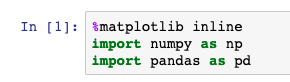
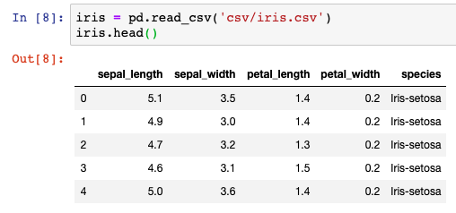
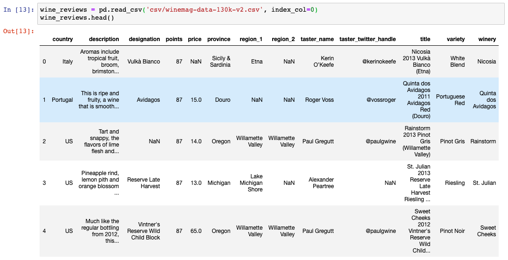
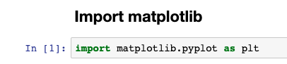
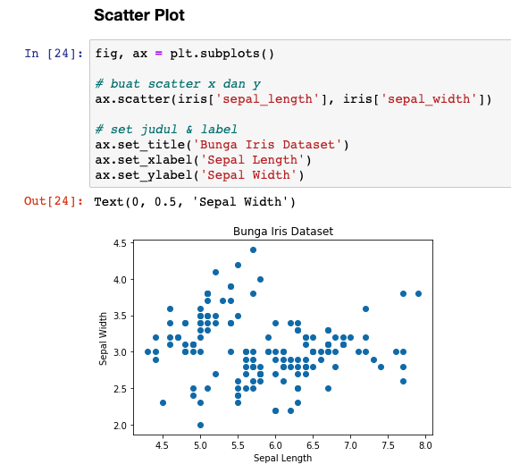
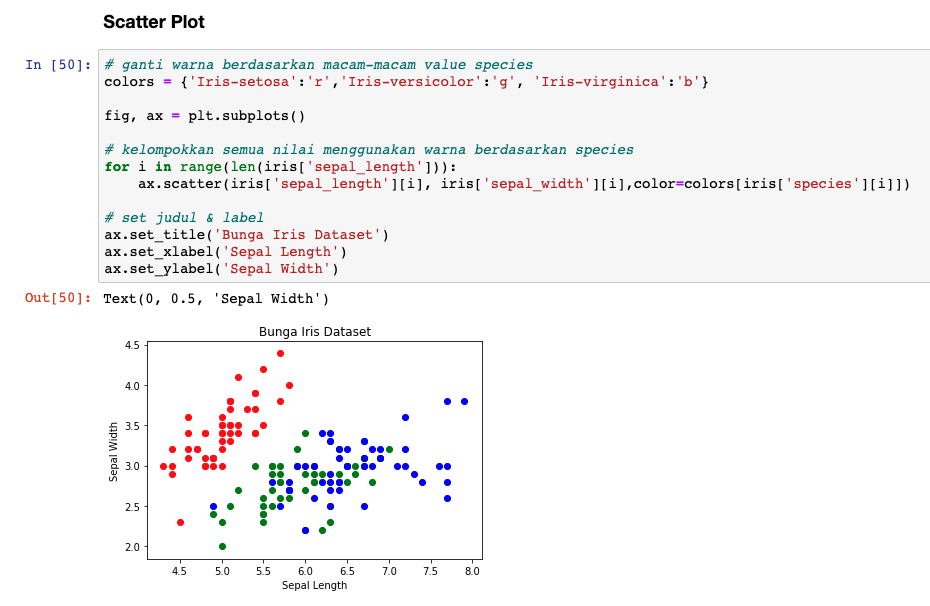
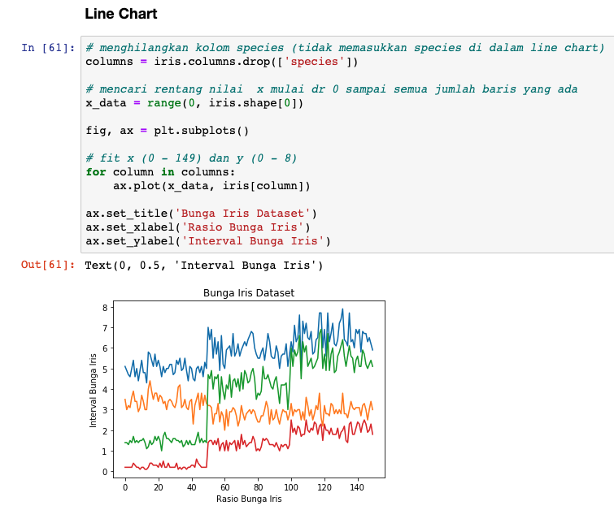
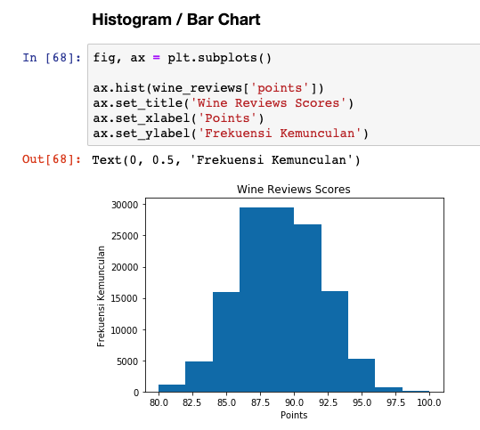

# Data Visualization

*Data visualization* merupakan **sebuah cara untuk memahami data dengan menempatkannya dalam sebuah konteks visual, sehingga pola, *trend*, dan korelasi yang mungkin tidak terdeteksi, bisa terlihat.**

> ***Trend* adalah garis yang biasanya menggambarkan pergerakan data.**

*Python* memberikan banyak *library* untuk grafik yang dibangun dengan berbagai fitur yang berbeda-beda. Grafik yang seperti apa yang kita inginkan? Interaktif? Live? Atau mudah dikostumisasi? *Python* memiliki semua *library* itu untuk kita gunakan.

Berikut beberapa *library* visualisasi yang populer:

- **Matplotlib**: *Low level interface*, sehingga **memberikan banyak kebebasan kepada kita untuk mengkostumisasinya.**
- **Pandas Visualization**: ***Interface*-nya mudah digunakan**, dibangun dari Matplotlib.
- **Seaborn**: *High level interface*, memiliki *style* yang sangat bagus.
- **ggplot**: Dibangun dari `ggplot2`, dari bahasa pemrograman R.
- **Plotly**: Dapat membuat plot yang interaktif.

Mari kita coba beberapa grafik dari `matplotlib` dan `pandas` dengan menggunakan **dataset [Bunga Iris](https://www.kaggle.com/arshid/iris-flower-dataset/download) dan [Wine Review](https://www.kaggle.com/zynicide/wine-reviews)**. Jangan khawatir csvnya sudah disatukan di dalam folder `jupyter/csv/nama_file.csv` (ganti `nama_file` dengan file yang mau di-*open*).

Pertama-tama, mari kita *load* ke dua data tersebut menggunakan *Pandas*.

- *Import* `numpy`, `pandas`, dan `%matplotlib inline` (untuk menampilkan grafik di *jupyter*).



- *Import* dataset Bunga Iris.



- *Import* dataset Wine Review. `index_col` digunakan untuk membuat kolom pertama sebagai indeks. 



## Matplotlib

*Matplotlib* merupakan *library python* yang sangat populer untuk membuat grafik standar seperti *line chart*, *bar chart*, *histogram*, dan masih banyak lagi.

`matplotlib.pyplot` adalah kumpulan fungsi perintah yang membuat *matplotlib* berfungsi seperti MATLAB. Setiap fungsi *pyplot* membuat beberapa perubahan pada gambar atau grafik.

> **Data kuantitatif menggunakan survei atau kuesioner yang disebar ke subjek penelitian sebagai metode penelitiannya**. Setelah data selesai dikumpulkan, perhitungan matematika dilakukan untuk mendapatkan kesimpulan. Umumnya, data kuantitatif juga menggunakan software dalam mengolah data, contohnya MATLAB, SPSS, dll.

Pertama, mari kita ***import matplotlib*** terlebih dahulu.

```py
import matplotlib.pyplot as plt
```



### Scatter Plot

***Scatter plot* adalah sebuah grafik yang biasa digunakan untuk melihat suatu pola hubungan antara 2 variabel.** Untuk bisa menggunakan *scatter plot*, skala data yang digunakan haruslah **skala interval (rentang nilai) dan rasio (banyak data)**.

Kita akan membuat sebuah *figure* *(propertise)* dan sebuah *axis* (x & y) menggunakan `plt.subplots` sehingga *plot* kita dapat memiliki judul dan label. *Text* 0 dan 0,5 adalah interval dari x dan y.

```py
fig, ax = plt.subplots()

# buat scatter x dan y
ax.scatter(iris['sepal_length'], iris['sepal_width'])

# set judul & label
ax.set_title('Bunga Iris Dataset')
ax.set_xlabel('Sepal Length')
ax.set_ylabel('Sepal Width')
```



Kita coba ganti warnanya berdasarkan *species* masing-masing data. Tambahkan spesifik warna berdasarkan masing-masing *species*:

```py
# ganti warna berdasarkan macam-macam value species
colors = {'Iris-setosa':'r','Iris-versicolor':'g', 'Iris-virginica':'b'}
```

*Fit* dengan setiap data:

```py
# kelompokkan semua nilai menggunakan warna berdasarkan species
for i in range(len(iris['sepal_length'])):
    ax.scatter(iris['sepal_length'][i], iris['sepal_width'][i],color=colors[iris['species'][i]])
```

*Jupyter:*



### Line Chart

Sebagian data dikumpulkan hanya pada satu waktu, namun beberapa orang tertarik untuk **melihat perubahan dari waktu ke waktu**. Skala data yang digunakan juga masih **skala interval (rentang nilai) dan rasio (banyak data)**

Dengan mengetahui ***trend* perubahan di masa lalu, diharapkan kita dapat memprediksi kejadian di masa depan atau lebih baik lagi, bisa memperbaiki kesalahan-kesalahan yang menyebabkan *trend* buruk dan meraih *trend* positif di masa depan.** *Line chart* adalah grafik yang tepat untuk menunjukkan perubahan data dari waktu ke waktu. Jika kita ingin membandingkan beberapa hal maka tinggal membuat *multiple line chart*, terus bedakan dengan warna.

*Matplotlib* juga dapat membuat *line chart* dengan memanggil `plot`. Kita juga dapat menampilkan beberapa kolom dalam satu grafik *(multiple line chart)*.

> *Pandas* meyediakan `shape[0]` untuk menghitung total baris dan `shape[1]` untuk menghitung total kolom.

```py
# menghilangkan kolom species (tidak memasukkan species di dalam line chart)
columns = iris.columns.drop(['species'])

# mencari rentang nilai  x mulai dr 0 sampai semua jumlah baris yang ada
x_data = range(0, iris.shape[0])

fig, ax = plt.subplots()

# fit x (0 - 149) dan y (0 - 8)
for column in columns:
    ax.plot(x_data, iris[column])

ax.set_title('Bunga Iris Dataset')
ax.set_xlabel('Rasio Bunga Iris')
ax.set_ylabel('Interval Bunga Iris')
```



### Histogram

Jika tujuan kita untuk **membandingkan satu hal dengan hal yang lain**, maka grafik batang atau histogram adalah opsi yang bagus.

Pada *matplotlib* kita dapat membuat histogram dengan memanggil `hist`. Untuk variasi kita akan gunakan data *point* dari *wine review*. Jika data kita dapat memenuhi kriteria kategori seperti kolom *point* pada data *wine review* (tidak ada baris yang kosong, semua data berbentuk angka, dll), maka `hist` dapat dengan otomatis **menghitung seberapa banyak data tersebut muncul (frekuensi)**.

```py
fig, ax = plt.subplots()

ax.hist(wine_reviews['points'])
ax.set_title('Wine Reviews Scores')
ax.set_xlabel('Points')
ax.set_ylabel('Frekuensi Kemunculan')
```



Dataset Wine Review: [https://drive.google.com/file/d/1lcVLHKhg2Xs40DjeYRxy77rbsUi-t2-J/view?usp=sharing](https://drive.google.com/file/d/1lcVLHKhg2Xs40DjeYRxy77rbsUi-t2-J/view?usp=sharing)
