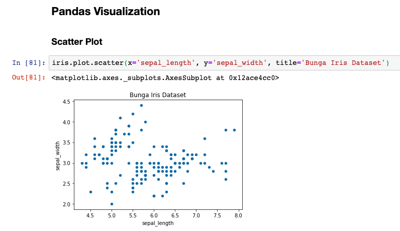
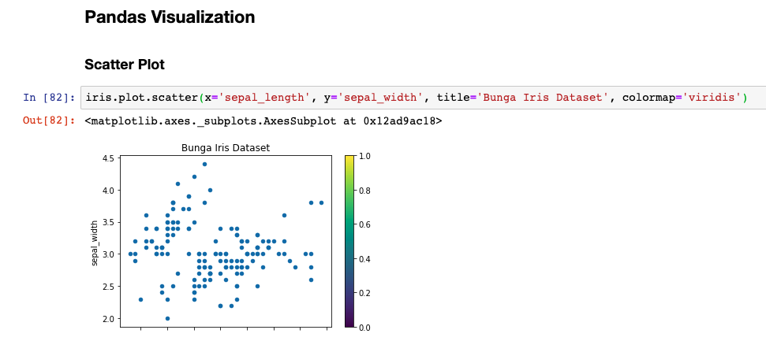
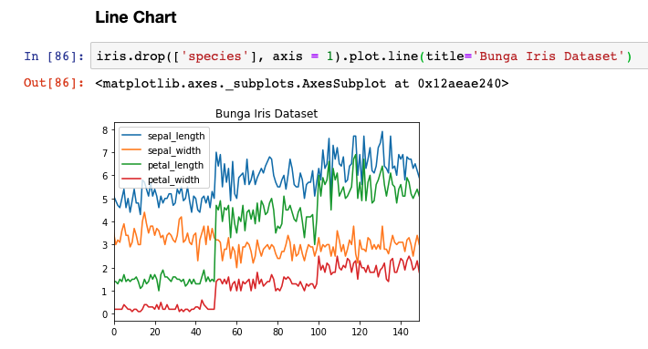
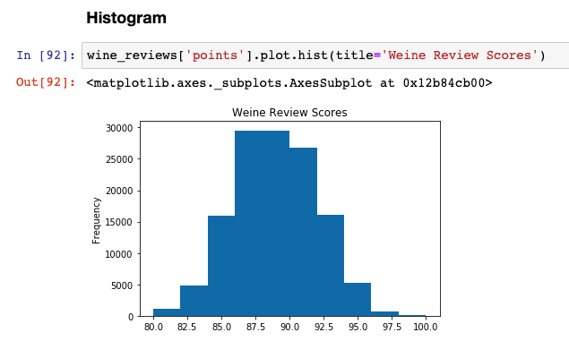
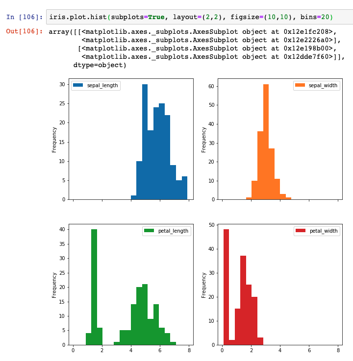
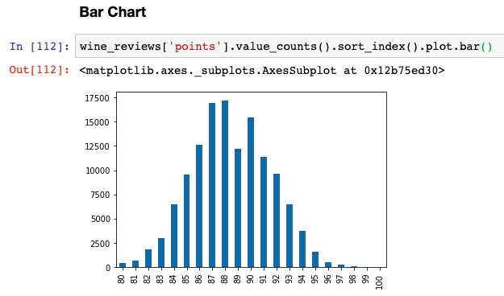
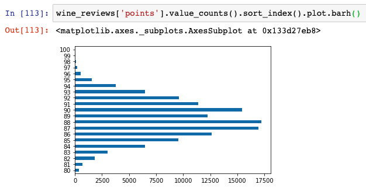
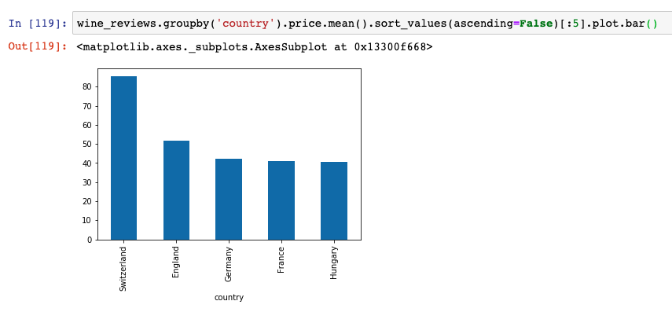

# Pandas Visualization

*Pandas* juga bisa kita gunakan untuk membuat visualisai data atau grafik. *Pandas* merupakan sebuah *library* *open source* yang *high-performance* dan *easy-to-use* yang menyediakan struktur data, seperti *dataframe* dan *series* serta berbagai macam visualisasi data.

*Pandas* memiliki API *(Application Programming Interface)* yang lebih tinggi level-nya dibanding *matplotlib*, sehingga kita **membutuhkan kode lebih sedikit untuk menghasilkan *output* yang sama**.

> API **memungkinkan *developer* (dalam hal ini *data scienctist*) untuk mengintegrasikan dua bagian dari aplikasi (atau dengan aplikasi yang berbeda) secara bersamaan**.

## Scatter Plot

Untuk membuat *scatter plot* menggunakan *Pandas*, kita dapat menggunakan **`df.plot.scatter()` dan memberikannya 2 argumen parameter, yaitu nama kolom x dan nama kolom y**. Dan kita memiliki pilihan untuk mengisi **argumen ke 3 untuk judul**.

```py
iris.plot.scatter(x='sepal_length', y='sepal_width', title='Bunga Iris Dataset')
```



Sayangnya di *Pandas* kita tidak bisa sespesifik *matplotlib* dalam mengkostumisasi visualisasi data kita. Jika ingin memberi warna ke masing-masing data, pandas membuatnya menggunakan `colormap='viridis'`.

```py
iris.plot.scatter(x='sepal_length', y='sepal_width', title='Bunga Iris Dataset', colormap='viridis')
```



## Line Chart

Untuk membuat *line chart* di *Pandas*, kita dapat menggunakan `df.plot.line()`. Di *matplotlib* harus melakukan *looping* semua kolom yang ingin kita *plot*, namun tidak di *Pandas*. Karena, **semua kolom yang memiliki tipe *number/numeric* otomatis ter-*plot*.**

```py
iris.drop(['species'], axis = 1).plot.line(title='Bunga Iris Dataset')
```



## Histogram

Di *Pandas* kita dapat membuat histogram dengan menggunakan `plot.hist`. Kita akan coba membuat histogram menggunakan dataset *wine review*.

```py
wine_reviews['points'].plot.hist(title='Weine Review Scores')
```



**Fungsi `plot.hist` tidak membutuhkan argumen tapi kita dapat menambahkan jumlah `bins` untuk mengatur berapa banyak nilai variabel x yang mau kita tampilkan.** Dan berikut cara untuk menampilkan beberapa histogram sekaligus menggunakan dataset bunga iris.

```py
iris.plot.hist(subplots=True, layout=(2,2), figsize=(10,10), bins=20)
```



- `subplots` merupakan argumen yang menegaskan bahwa kita menginginkan plot yang terpisah untuk setiap kolomnya. Nilainya adalah *boolean*.

- `layout` dan `figsize` digunakan untuk menentukan ukuran masing-masing histogram.

## Bar Chart

Untuk membuat *bar chart* kita dapat menggunakan `plot.bar()`, namun sebelumnya kita harus **menghitung jumlah data menggunakan `value_count()` dan melakukan *sorting* dari nilai terkecil ke nilai terbesar menggunakan `sort_index()`**. Kita akan mencoba membuat *bar chart* menggunakan dataset *wine review*.

```py
wine_reviews['points'].value_counts().sort_index().plot.bar()
```



Dan untuk membuat Bar Chart yang horizontal dengan menggunakan `plot.barh()`.

```py
wine_reviews['points'].value_counts().sort_index().plot.barh()
```



Kita juga dapat:

- **Mengelompokkan data berdasarkan negara** menggunakan `groupby('country')`.
- **Mengambil rata-rata harga *wine*** menggunakan `price.mean()`.
- **Menyusunnya dan mengambil data 5 negara dengan rata-rata harga tertinggi** menggunakan `sort_values(ascending=False)[:5]`.

```py
wine_reviews.groupby('country').price.mean().sort_values(ascending=False)[:5].plot.bar()
```


