# Pre-requisite

Tujuan dari materi kali ini adalah supaya teman-teman dapat mengetahui bagaimana menggunakan *library python* untuk *data science* (`numpy`, `pandas`, `matplotlib`, dan `sklearn`) untuk **memprediksi sesuatu berdasarkan variabel** menggunakan algoritma *machine learning* yang termasuk ke dalam kelompok *supervised learning*, yaitu **regresi linier**.

> *Scikit-learn* atau `sklearn` *library* adalah *library* untuk *machine learning* bagi para pengguna *python*. ***Scikit-learn* memungkinkan kita melakukan beragam pekerjaan dalam proses *data science***. Di dalam *scikit-learn* terdapat algoritma *machine learning* yang sudah jadi dan tinggal kita pakai seperti regresi (regression), klasifikasi (classification), dan masih banyak lagi.

Dataset yang disediakan di dalam *folder* Day-15/csv/:

- [Dataset **gaji karyawan**](https://www.kaggle.com/karthickveerakumar/salary-data-simple-linear-regression)

Atau kita juga bisa menggunakan **dataset yang sudah ada di dalam *scikit-learn***.

Kita *import* dulu `datasets` dari `sklearn` seperti ini:

```py
from sklearn import datasets
```

Berikutnya, kita ingin melihat *datasets* apa saja yang tersedia pada *scikit-learn*:

```py
datasets.*?
```

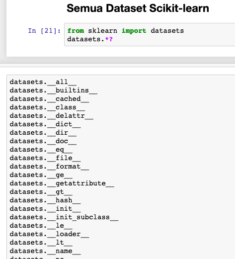

Lalu *datasets* apa saja yang menjadi bawaan atau *default* dari *scikit-learn* ini:

```py
datasets.load_*?
```

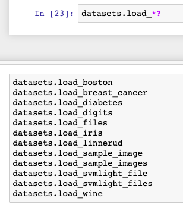

Pada masing-masing dataset (di *folder* atau *scikit-learn*) yang sifatnya data kuantitatif, bisa kita jadikan variabel untuk prediksi, **kemudian kita tarik pertanyaan yang nantinya akan kita coba selesaikan untuk menghasilkan *insight* tertentu** dengan menggunakan *regresi linier*. Tetapi karena keterbatasan waktu teman-teman bisa mencoba dataset yang ada di dalam `sklearn` sendiri-sendiri.

Selanjutnya kita akan membagi alur atau tahapan *data science* menjadi 5 bagian:

1. Pendefinisian Masalah
2. Pengumpulan Data
3. Persiapan Data
4. Melatih Model
5. Menguji Akurasi

## Dataset Gaji Karyawan

Dataset gaji karyawan sebenarnya sudah pernah kita bahas pada macam algoritma *machine learning*, *supervised learning* yang regresi linier. Jangan lupa *import* dulu library yang dibutuhkan, yaitu `numpy`, `pandas`, `matplotlib`, dan `scikit-learn`:

```py
import numpy as np # numpy
import pandas as pd # pandas
import matplotlib.pyplot as plt # matplotlib
import sklearn # scikit-learn
```

### Pendefinisian Masalah Gaji

**Pertanyaanya adalah:**

Pada perusahaan ABC, kita di-*hire* sebagai *data scientist* untuk menganalisis berbagai pekerjaan yang harusnya bisa dikerjakaan oleh sistem. Pekerjaan pertama yang harus dilakukan berkaitan dengan divisi HR *(Human Resource)*.

Permasalahannya adalah apa yang harus dilakukan untuk **menentukan berapa gaji terbaik yang harus diberikan kepada kandidat karyawan baru yang memiliki pengalaman bekerja selama 10 tahun?**

Sekarang kita diminta untuk menyelesaikan suatu masalah di atas, tapi bagaimana caranya mengetahui gaji terbaik untuk kandidat tersebut? Tenang, ini waktunya *machine learning* memprediksi gaji terbaik untuk kandidat kita.

***Insight* penting:**

- Yang dicari (`y`) adalah **gaji**
- Berdasarkan (`x`) **pengalaman bekerja**

Selanjutnya kita butuh mengumpulkan data-data pendukung (jika diperlukan) demi kesempurnaan model prediksi yang mau kita buat.

### Pengumpulan Data Gaji

Persamaan regresi linier sederhana **membutuhkan nilai x sebagai variabel yang mempengaruhi *(independent)* dan nilai y sebagai variabel yang dipengaruhi *(dependent)* dalam bentuk kuantitatif atau angka**.

Di perusahan ABC, terdapat tabel nilai gaji berdasarkan tahun pengalaman kerja karyawan seperti di bawah ini:

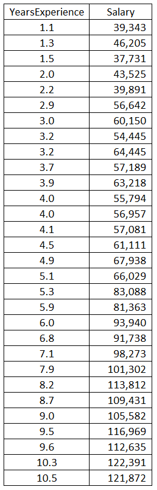

Untungnya kita mempunyai tabel dengan kolom pengalaman *(YearExperience)* dan gaji *(salary)* dengan value angka-angka yang dapat dijadikan x dan y.

### Persiapan Data Gaji

Sekarang kita download *folder* Day-15, di dalam *folder* `csv/gaji-karyawan/` terdapat dataset dengan nama `salary_data.csv`. *Import* dulu dataset kita yaitu `salary_data.csv` ke dalam *jupyter notebook*:

```py
df_gaji = pd.read_csv('../csv/gaji-karyawan/salary_data.csv')
df_gaji
```

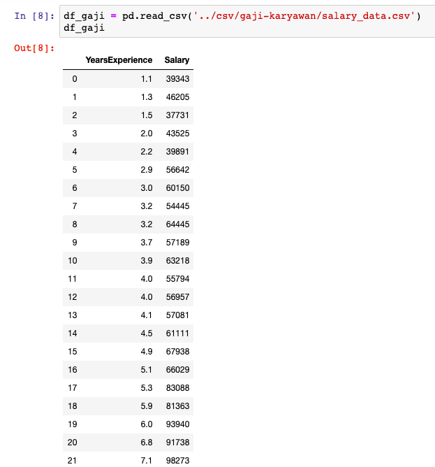

Selanjutnya, kita akan mengeksplor beberapa hal dari data yang kita punya:

1. Melihat *shape* dataset
2. Melihat lima baris teratas dataset
3. Memperoleh deskripsi singkat dari dataset

#### Melihat *shape* dataset

Kita bisa melihat baris dan kolom dari dataset yang kita punya dengan menggunakan:

```py
df_gaji.shape
```

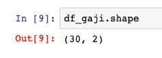

Jika kita lihat dari gambar di atas, artinya terdapat 30 baris dan 2 kolom dari dataset yang kita punya.

#### Melihat Lima Baris Teratas

Jalankan perintah berikut, untuk melihat **lima baris awal** dari dataset kita:

```py
df_gaji.head()
```

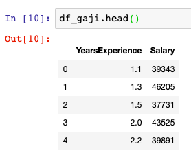

Setiap baris data merepresentasikan satu karyawan yang ada di perusahaan ABC. Dataset ini memiliki 2 atribut atau 2 *features* atau 2 kolom, yaitu *YearExperience* dan *Salary*.

#### Memperoleh Deskripsi Singkat dari Dataset

Selanjutnya, untuk memperoleh informasi singkat mengenai data kita, gunakan fungsi `info()`. **Informasi singkat tersebut, diantaranya: Jumlah baris atau jumlah observasi, tipe data dari setiap atribut atau *features* atau kolom, dan jumlah dari nilai tidak nol (*non-null values*)**.

```py
df_gaji.info()
```

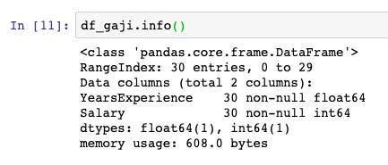

Dari info dataset di atas, terlihat bahwa terdapat 30 baris data atau jumlah observasi. Jumlah tersebut tergolong sangat kecil untuk ukuran *machine learning*, namun merupakan contoh yang baik untuk tahap belajar.

Kolom *YearExperience* bertipe data *float*, sedangkan kolom *Salary* bertipe data *int*. Semua variabel di atas adalah variabel numerik.

Pastikan tidak ada baris yang bernilai *null* untuk menghindari terjadinya *error*.

Selanjutnya, dengan menggunakan fungsi `describe()`, kita akan mendapatkan ***summary* statistik (count, mean, std, min, max, 25% percentile, 50% percentile, dan 75% percentile)**, dari atribut-atribut numerik.

```py
df_gaji.describe()
```

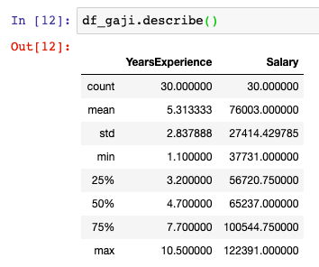

Hasil dari *count*, *mean*, *min*, dan *max* sudah cukup jelas. *Std* **menunjukkan deviasi standar *(standard deviation)* atau simpangan baku (yang mengukur tingkat dispersi atau persebaran suatu nilai)**.

**25%, 50%, dan 75% baris menunjukkan persentil atau *percentile* (persentil mengindikasikan nilai suatu observasi (karyawan perusahaan ABC) berada di bawah atau dalam rentang persentase yang diberikan**.

Sebagai contoh:

- 25% dari karyawan memiliki *Salary* di bawah $56.720
- 50% karyawan memiliki *Salary* di bawah $65.237
- 75% memiliki *Salary* di bawah $100.544

**Persentil seringkali disebut juga sebagai kuartil atau *quartile*. 25% adalah kuartil pertama (*1st quartile*), 50% adalah kuartil kedua, atau median, dan 75% adalah kuartil ketiga (*3rd quartile*)**.

### Melatih Model Gaji

Sebelum lanjut, kita jabarkan dulu **pembuatan model menjadi dua bagian**:

1. *Training*
2. *Predict*

#### Training

Kita **pisahkan dulu nilai x dan y** dari dataset seperti berikut:

```py
x = df_gaji.iloc[:, :-1] # x berisisi kolom YearExperience
y = df_gaji.iloc[:, 1:] # y berisi kolom Salary
```

**Penjelasan kode:**

- `iloc[baris,kolom]` digunakan untuk ***slicing* baris dan kolom**
- `:-1` digunakan untuk **mengambil semua kolom kecuali kolom terakhir**
- `1:` digunakan untuk **mengambil semua kolom kecuali kolom pertama**

Dalam statistik dan *machine learning* **kita biasanya membagi (mempartisi) data menjadi dua *subset***, yaitu ***training* data** dan ***testing* data**. Di mana:

- *Training data* digunakan untuk **membuat model**
- *Testing data* digunakan untuk **mengukur *score* akurasi model yang kita buat**

*Scikit-learn* menyediakan beberapa fungsi untuk membagi dataset menjadi beberapa subset dengan berbagai cara. Fungsi yang paling sederhana adalah `train_test_split`. Berikut cara menggunakannya:

```py
# import train_test_split dari sklearn.model_selection
from sklearn.model_selection import train_test_split

x_train, x_test, y_train, y_test = train_test_split(x, y, test_size=1/3, random_state=0)
```

**Penjelasan kode:**

- `test_size=1/3` atau `test_size=0.3`

    Maksudnya adalah **30% dataset gaji-karyawan akan dijadikan testing data**. Berarti `test_size = total_data / (30 * 100%)`. Dalam kasus kali ini `total_data` adalah 30 observasi. `test_size` = 10 observasi. **Sisa dari `total_data` = 20 observasi atau 70% dari `total_data`, akan otomatis dijadikan sebagai `train_size`.**

    Kita bisa saja merubah `test_size` menjadi 1/2 atau 0.5. Yang harus diperhatikan **kita tidak boleh membuat `test_size` lebih besar dari `train_size`**. Jika terlalu besar, dikhawatirkan akan mengurangi akurasi dari model yang kita akan buat nanti. Idealnya 80/20 atau 70/30.

- `random_state=0`

    Ketika kita memisahkan data menjadi *train* dan *test*, fungsi `train_test_split` akan otomatis memilih angka random dari observasi yang kita miliki. Jika nilai yang diambil selalu berubah ketika kita menjalankan model, maka model kita dinilai tidak konsisten. Untuk menghindari nilai *train* dan *test* yang berbeda-beda setiap model dijalankan, maka kita harus men-*set* `random_state` kita.

    `random_state` bisa disikan bebas, tetapi jika kita hanya ingin menggunakan 0 saja juga tidak masalah.

Kita sudah memisahkan data menjadi *train set* (70% = 20 observasi) dan *test set* (30% = 10 observasi). Sekarang saatnya kita membuat model menggunakan *train set*:

```py
# Import LinearRegression dari sklearn.linear_model
from sklearn.linear_model import LinearRegression

# masukkan fungsi LinearRegression ke dalam variabel regressor
regressor = LinearRegression()

# gunakan training data untuk membuat model
regressor.fit(X_train, y_train)
```

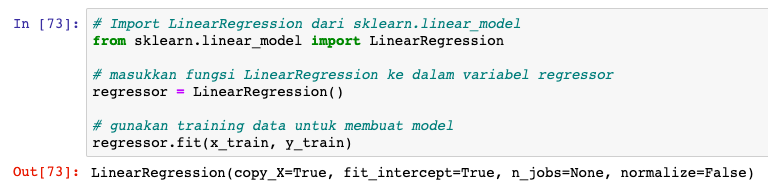

**Penjelasan kode:**

- `regressor.fit(x_train,y_train)` di baris ini kita memasukkan variabel `x_train` yang berisi *YearExperience* dan `y_train` yang berisi *Salary* dari 20 observasi data *training*. Ini yang dinamakan **proses *training***.

#### Predict

Selamat! Kita sudah mempunyai model. Sekarang kita bisa **menggunakan model ini untuk memprediksi semua nilai `y` *(Salary)* berdasarkan `x` *(YearExperience)* menggunakan *testing data* (30% = 10 observasi)** yang sudah kita buat. Pertama, untuk menjawab pertanyaan di atas kita prediksi dulu gaji tertinggi karyawan jika pengalam kerjanya 10 tahun:

```py
# Prediksi gaji kandidat karyawan baru yg memiliki 10 tahun pengalaman kerja
y_pred = regressor.predict([[10]])

print('Gaji tertinggi yang bisa diberikan adalah $', int(y_pred))
```

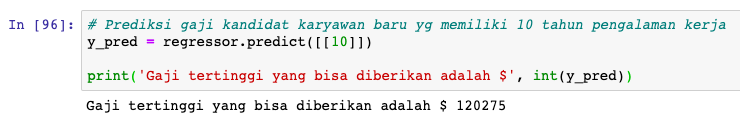

**Penjelasan kode:**

- `.predict([[10]])` adalah fungsi yang digunakan untuk memprediksi nilai gaji. 10 adalah total pengalaman dalam satuan tahun.
- `int(y_pred)` digunakan untuk mengkonversi `y_pred` yang tipe datanya `float` menjadi `int`.

***Insight* penting:**

> HR bisa menawarkan kepada kandidat yang memiliki 10 tahun pengelaman **gaji sebesar $120.275**. Ini adalah gaji terbaik untuknya berdasarkan data dari perusahaan ABC.

Selain itu, kita juga bisa mengganti tahun pengalaman menggunakan *testing data* yang tadi sudah kita buat menjadi seperti ini:

```py
# Prediksi gaji berdasarkan x_test
y_pred = regressor.predict(x_test)

# membuat dataframe untuk y_test dan y_pred
df1 = pd.DataFrame(y_test).reset_index(drop=True)
df2 = pd.DataFrame(y_pred, columns=['Predicted Salary']).reset_index(drop=True)

df1.join(df2)
```

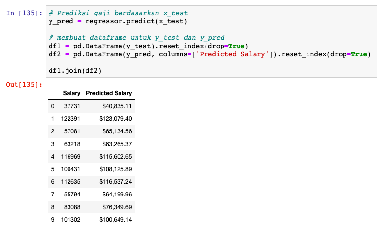

**Penjelasan kode:**

- `reset_index(drop=True)` digunakan untuk membuat indeks dimulai dari 0.

Dari data di atas kita bisa melihat, di sebelah kiri adalah ***testing data*** (nilai asli) dan yang sebelah kanan adalah **prediksi data**.

***Insight* penting:**

> Kita menemukan bahwa **pada indeks ke-4, 8, dan 9 nilai prediksi lebih rendah dari pada nilai asli**. Ini bisa saja disebabkan oleh banyak faktor. Temuan ini bisa dijadikan sebagai acuan untuk pembuatan model selanjutnya.

### Menguji Akurasi Model Gaji

*Finally*, pada tahap ini, kita akan melihat berapa persen akurasi dari model yang telah kita buat. Dengan kata lain, **akurasi di sini bermaksud mengitung sejauh mana sih si model kita memprediksi gaji berdasarkan *YearExperience***. Untuk melihat *score* akurasi dari model yang kita buat, kita bisa menggunakan fungsi `score()` seperti ini:

```py
# masukan model yang menggunakan training data ke dalam variabel
model = regressor.fit(x_train, y_train)

# tampilkan nilai score dari model yang menggunakan test data
print('Score dari model adalah', model.score(x_test,y_test))
```

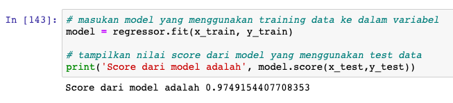

*Score* untuk model yang kita buat adalah 0.97.
