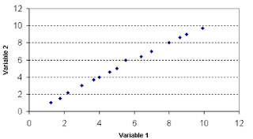
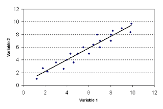
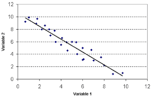
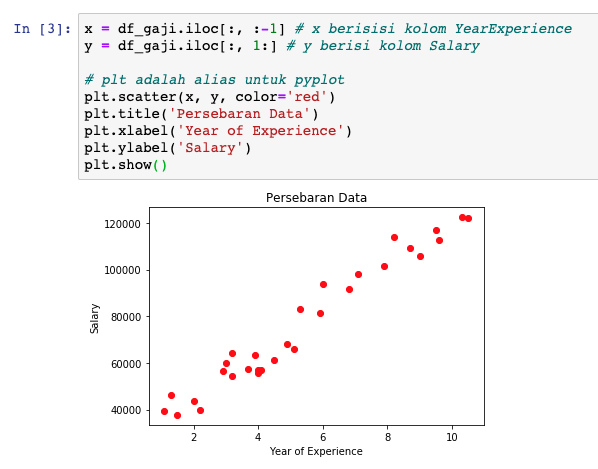
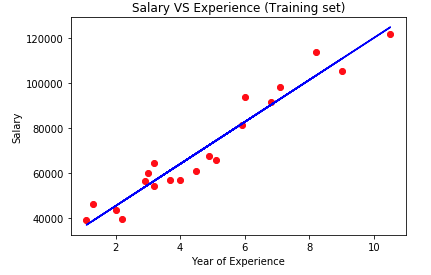
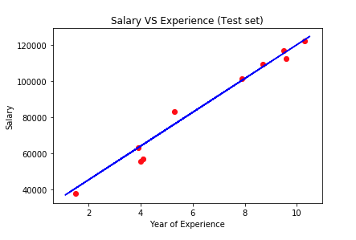
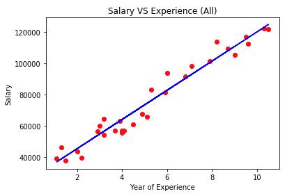
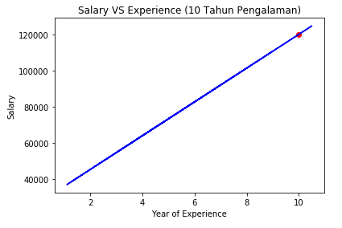

# Pre-requisite

Tujuan dari materi kali ini adalah agar **memudahkan seseorang untuk membaca data yang jumlahnya ribuan bahkan jutaan yang sulit untuk diteliti hanya menggunakan tabel saja**.

## Scatter Plot

Visualisasi yang biasanya ada pada setiap prediksi regresi adalah *scatter plot*. Dengan *scatter* kita bisa mengetahui apakah dataset yang mau kita prediksi memiliki suatu hubungan? Jika tidak, kita tidak bisa menggunakan data tersebut untuk prediksi, tapi jika ada kita bisa menggunkananya untuk diprediksi. Lalu bagaimana caranya kita tau dataset kita memiiki hubungan? Berikutnya kita akan membahas beberapa hubungan yang muncul ketika kita memvisualisasikan data kita mengguanakn *scatter plot*.

### Keeratan Hubungan



Jika *scatter plot* membentuk pola yang menyerupai garis lurus seperti pada gambar di atas, artinya *scatter plot* mengindikasikan bahwa ada hubungan yang erat antara variabel 1 (`x`) dengan variabel 2 (`y`).

**Hubungan yang membentuk garis lurus biasa disebut dengan hubungan linier.** Hubungan linier bisa membentuk hubungan yang positif atau negatif.

**Hubungan Positif:**



Jika plot yang terjadi seperti pada gambar ini, maka variabel 1 dan variabel 2 menunjukkan **hubungan yang positif**. **Peningkatan yang terjadi pada variabel 1 juga diikuti peningkatan pada variabel 2**. **Dan jika variabel 1 mengalami penurunan, variabel 2 juga mengalami penurunan.**

> Bahasa mudahnya adalah **kalau x naik, berarti y naik semua dan kalau x turun, berarti y turun semua**.

**Hubungan Negatif:**



Jika plot yang terjadi seperti pada gambar ini, maka variabel 1 dan variabel 2 menunjukkan **hubungan yang negatif**. **Peningkatan yang terjadi pada variabel 1 diikuti penurunan oleh variabel 2**. **Dan jika variabel 1 mengalami penurunan, variabel 2 akan mengalami peningkatan.**

> Bahasa mudahnya adalah **kalau satunya naik yang lain turun dan kalau satunya turun maka yang lain akan naik.**

**Hubungannya Rendah:**


Jika titiknya menyebar seperti pada gambar ini, maka bisa disimpulkan bahwa **hubungan antara variabel 1 dengan variabel 2 sangatlah kecil Atau tidak ada hubungan**.

> **Biasanya dataset seperti ini digunakan untuk klasifikasi.**

## Scatter Plot Dataset Gaji Karyawan

Untuk melihat hubungan pengalaman dan gaji berdasarkan persebaran dataset gaji karyawan, kita bisa tambahkan visualisai data pada tahapan persiapan datanya seperti berikut:

```py
x = df_gaji.iloc[:, :-1] # x berisisi kolom YearExperience
y = df_gaji.iloc[:, 1:] # y berisi kolom Salary

# plt adalah alias untuk pyplot
plt.scatter(x, y, color='red')
plt.title('Persebaran Data')
plt.xlabel('Year of Experience')
plt.ylabel('Salary')
plt.show()
```



> Kita belum bisa membuat garis regresi yang melintang karena kita belum memiliki model untuk memprediksi nilai x. Jadi, kita bayangkan saja terlebih dahulu ada garis yang melintang di diagram.

Setelah kita lihat gambarnya, ternyata persebaran data observasinya tidak semua berpotongan dengan garis. Tetapi jangan khawatir, di sini kita bisa melihat **datanya memiliki hubungan yang positif**. Kita bisa buktikan datanya positif karena **setiap x naik, y naik semua dan kalau x turun, y juga turun semua**.

Nah sebenarnya dari *scatter plot* ini saja, kita sudah bisa melihat orang yang pengalaman kerjanya 10 tahun bisa mendapatkan gaji 100k - 120k ke atas. Tetapi **kita belum tau bagaimana caranya memberikan gaji dengan nominal pasti dari rentang nilai 100k - 120k ke atas bukan?** Untuk itu kita gunakan *machine learning* *regresi linier* untuk memprediksinya.

## Scatter Plot Hasil Prediksi Regresi Linier

**Menggunakan *training* data:**

```py
# Hasil Visualisasi Training Data

plt.scatter(x_train, y_train, color='red')
plt.plot(x_train, regressor.predict(x_train), color='blue')
plt.title('Salary VS Experience (Training set)')
plt.xlabel('Year of Experience')
plt.ylabel('Salary')
plt.show()
```



**Menggunakan *test* data:**

```py
# Hasil Visualisasi Testing Data

plt.scatter(x_test, y_test, color='red')
plt.plot(x_train, regressor.predict(x_train), color='blue')
plt.title('Salary VS Experience (Test set)')
plt.xlabel('Year of Experience')
plt.ylabel('Salary')
plt.show()
```



**Menggunakan data asli:**

```py
# Hasil Visualisasi Semua Data

plt.scatter(x, y, color='red')
plt.plot(x_train, regressor.predict(x_train), color='blue')
plt.title('Salary VS Experience (All)')
plt.xlabel('Year of Experience')
plt.ylabel('Salary')
plt.show()
```



> Kode `plt.plot(x_train, regressor.predict(x_train), color='blue')` digunakan untuk membuktikan prediksi kita berhasil (linier). `plot(x,y,color='b')` akan menarik garis dari nilai terkecil ke nilai terbesar yang terdapat pada variabel x atau y, sedangkan `color='b'` akan merubah warnanya menjadi biru.

Ternyata setelah kita buat prediksi menggunakan regresi linier dan kita visualisasikan prediksi kita menggunakan *data training*, *test*, dan semua data, prediksi kita juga menghasilkan garis yang linier (garis berwarna biru dari bawah ke atas) artinya prediksi kita berhasil.

## Scatter Plot Prediksi Gaji dengan pengalaman 10 Tahun

```py
y_pred = regressor.predict([[10]])

# Visualisasi Gaji dengan Pengalaman 10 Tahun

plt.scatter(10, y_pred, color='red')
plt.plot(x_train, regressor.predict(x_train), color='blue')
plt.title('Salary VS Experience (10 Tahun Pengalaman)')
plt.xlabel('Year of Experience')
plt.ylabel('Salary')
plt.show()
```



Dengan *scatter plot* kita bisa melihat hasil prediksi gaji dengan pengalaman 10 tahun melalui diagram.
