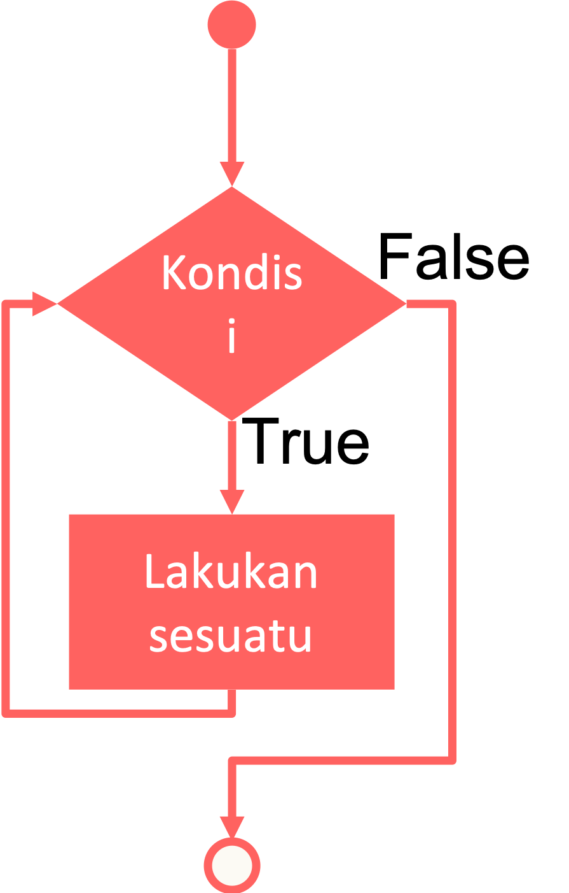

# Perulangan While

Dalam bahasa pemrograman *Python* terdapat 2 buah struktur perulangan atau *looping*, yaitu perulangan *while* dan perulangan *for*. Sekarang kita akan bahas perulangan yang pertama, yaitu *while*.

## Pengertian While

Perulangan *while* adalah cara iterasi di dalam pemrograman *python* yang paling umum digunakan. Sederhananya, *while* melakukan perulangan eksekusi sebuah blok kode selama kondisi yang ditentukan dibagian awal terpenuhi atau *true*. Untuk lebih jelasnya perhatikan gambar di bawah ini:



Dalam merancang perulangan, kita setidaknya harus mengetahui 3 komponen:

1. Kondisi awal perulangan.
2. Kondisi pada saat perulangan.
3. Kondisi yang harus dipenuhi agar perulangan berhenti.

Berikut format dasar struktur perulangan *while* dalam bahasa *Python*:

```py
start;
while condition:
  # kode program yang akan diulang
  # kode program yang akan diulang
  increment
```

Di bagian `start` biasanya berupa perintah inisialisasi variabel *counter*, misalnya `i = 0`. Di bagian `condition` terdapat kondisi yang harus dipenuhi agar perulangan berjalan, misalnya `i < 5`. Kemudian perintah `increment` di dalam *block* perulangan yang di pakai untuk menaikkan nilai variabel *counter*, misalnya dengan perintah `i = i + 1`.

Perhatikan tabulasi yang ada di dalam block perulangan. Setelah kita mengetikkan tanda `:` dan memencet enter, kita harus menambahkan tabulasi *(pencet keyboard tab)* satu kali untuk membuat indentasi yang setelahnya adalah isi dari perulangan kita.

Berbeda dengan bahasa pemrograman turunan *C* (seperti *C++, Java, PHP* maupun *JavaScript*), di dalam *Python* tidak dikenal operator *increment* seperti `i++` atau `i--`. Untuk menaikkan angka *counter*, kita bisa menggunakan perintah `i = i + 1` atau menggunakan operator *assignment* gabungan seperti `i += 1`.

## Infinity Loop

Salah satu hal yang harus selalu diingat ketika membuat perulangan *while* adalah jangan lupa membuat perintah *increment*. Jika tidak, kondisi akhir tidak akan pernah terpenuhi dan perulangan akan berjalan terus menerus.

Kita akan mencoba bentuk *while* yang paling sederhana yang dapat menyebabkan kondisi *looping forever* atau proses perulangan yang tidak pernah akan selesai karena kondisi selalu *True*. Jangan lupa pencet enter 2x untuk menjalankan perulangan.

```py
while True:
    print('Type Ctrl-C to stop me!')
```

Dan program secara terus menerus mencetak pesan `'Type Ctrl-C to stop me!'`. Penyebabnya karena kondisi selalu bernilai *true.* Di dalam blok perulangan tidak ada perintah yang bisa mengubah nilai `True` agar bernilai `False`. Dan untuk berhenti kita bisa menggunakan tombol `Ctrl-C` atau bisa juga dengan tutup paksa aplikasi *IDLE Python*.

## Menghilangkan Karakter

Kita lihat contoh yang lebih menarik yuk. Misalkan kita ingin menampilkan pesan dengan efek *speaker echo*. sebenarnya karakter dari kalimat `spam` dikurangi satu karakter depan hingga semua karakter yang ada di kata tersebut habis.

```py
# echoing effect

message = 'spam'
while message != '':
    print(message, end=' ') # end=' ' digunakan untuk membuat spasi
    message = message[1:] # [1:] artinya teks dikurangi satu persatu dr teks paling awal

# echoing effect tanpa != ''

message = 'spam'
while message:
    print(message, end=' ') # end=' ' digunakan untuk membuat spasi
    message = message[1:] # [1:] artinya teks dikurangi satu persatu dr teks paling awal
```

`!= ''` bisa dihilangkan menjadi `while message` karena *string* kosong bisa dianggap *false* atau *falsy*.

## Penambahan Angka

Contoh berikutnya, kita akan mencetak angka dari variabel a ke b.

```py
a = 1
b = 10
while a <= b:
    print(a, end=' ')
    a = a + 1
```

Pertama, kita mendeklarasikan dua buah variabel dengan isian `a = 1` dan `b = 10`.

Ke dua, kita buat perulangan menggunakan *while* dengan kondisi untuk mengecek apakah `a <= b` atau `1 <= 10`? Selama `a` *value*-nya belum sama dengan `10`, perulangan akan terus dilakukan.

Ke tiga, kita tampilkan *value* `a`, diikuti oleh spasi. Perintah ini akan terus diulang selama `a` belum sama dengan `b`.

Ke empat, kita buat *increment* untuk menambahkan *value* `a` menggunakan `a = a + 1`. Perintah ini juga akan terus diulang selama `a` belum sama dengan `b`, sehingga *output*-nya akan menjadi `1 2 3 4 5 6 7 8 9 10`.

## Break, Continue, dan Pass

Mungkin untuk beberapa kasus kita dapat berhenti dan keluar atau melanjutkan dari perulangan secara **'paksa'**. Untuk kebutuhan-kebutuhan tersebut kita bisa gunakan beberapa sintaks seperti `break`, `continue`, dan `pass`.

### Break

`Break` digunakan untuk keluar dari perulangan.

```py
# Contoh break (menghentikan perulangan secara paksa)

while True:
   name = input('Masukkan Nama: ') # input() digunakan untuk mengambil masukan dari keyboard
   if name == 'stop': # if untuk menentukan kondisi
       break # jika yg diketikkan stop maka program berhenti
   age = input('Masukkan Umur: ')
   print('Hello', name, '=>', age) # Hello name => age
```

### Continue

`Continue` digunakan untuk kembali ke blok teratas dari sebuah perulangan dan melanjutkan proses perulangannya.

```py
# Contoh continue (mengembalikan ke baris awal perulangan)

var = 6 # deklarasi variabel
while var > 0: # perulangan akan terus dilakukan selama var masih lebih besar dari 0
    var = var -1
    if var == 3:
      continue # 3 akan diskip karena perulangan kembali ke awal
    print('Nilai variabel sekarang ', var)
```

### Pass

`Pass` tidak akan melakukan apapun. Sering digunakan sebagai *placeholder* kosong dari sebuah perulangan.

```py
# Contoh pass (tidak melakukan apa2 tp bisa menjalankan program)

var = 5
while var:
    pass # pass dihilangkan akan error
```
