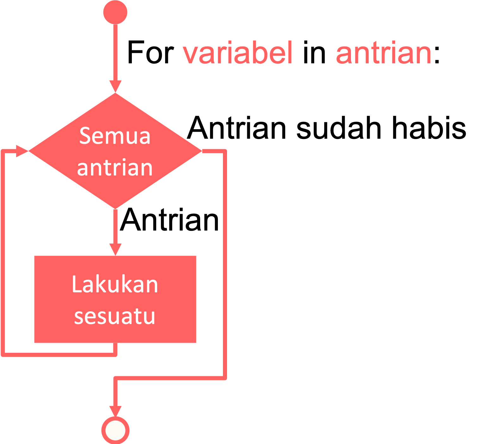

# Perulangan For

Masih membahas tentang perulangan, sekarang kita akan mempelajari cara penggunaan perulangan *for* dalam bahasa pemrograman *Python*.

## Pengertian For

Selain *while*, *for* adalah sebuah perulangan yang bisa digunakan di mana-mana, baik itu *string*, *list*, *tuple*, dan apapun selama itu objek yang bisa diulang.

Berbeda dengan mayoritas bahasa pemrograman lain, di dalam *Python* perulangan *for* lebih ke perulangan untuk memproses *array* atau himpunan. Ini mirip seperti perulangan *foreach* di bahasa pemrograman lain.



Pada diagram di atas, perulangan *for* akan dijalankan sebanyak jumlah antrian. Sepanjang perulangan variabel akan berisi antrian yang sedang diproses.

Berikut format dasar struktur perulangan *for* dalam bahasa *Python*:

```py
foo = [a, b, ...]
for i in foo:
  # kode program yang akan diulang
  # kode program yang akan diulang
```

Dalam format ini, di awal kita mendefinisikan variabel *foo* sebagai sebuah *array* atau himpunan (salah satu dari tipe data *string*, *list*, *tuple*, atau *dictionary*).

Perulangan *for* akan dijalankan sebanyak jumlah *value* yang ada di dalam variabel *foo*. Sepanjang perulangan, variabel `i` akan berisi *value* yang sedang di proses. Penjelasan ini akan lebih mudah dipahami dengan contoh kode program.

## Mengeluarkan isi List

Mari kita lihat contoh sebenarnya. Misalkan, kita punya *list* dari kata-kata acak yang ingin kita cetak satu per satu. Kita bisa menggunakan *for* untuk mengambil satu kata dan mencetaknya, kata berikutnya, dan seterusnya sampai seluruh isi *list* di dalam variabel acak tersebut habis.

```py
acak = ["spam", "inbox", "sent"]
for word in acak:
    print(word, end='\n') # \n digunakan untuk spasi ke bawah
```

## Penjumlahan dan Perkalian

Kita juga dapat melakukan operasi matematika seperti penjumlahan ataupun perkalian semua bilangan di dalam *list* seperti berikut.

```py
# Penjumlahan
sum = 0
for i in [1,2,3,4]:
    sum = sum + i

sum # 10

# Perkalian
prod = 1
for item in [1, 2, 3, 4]:
    prod = prod * item

prod # 24
```

## String dan Tuple dengan For

Sekarang kita akan coba menggunakan *for* untuk *string* dan *tuple*.

```py
text = "foxy fox" # string
words = ("is", "great", "animal") # tuple

for chakra in text:
    print(chakra, end=" ")
# f o x y   f o x

for word in words:
    print(word, end="... ")
# is... great... animal...
```

## Pattern Matching

Perulangan *for* sangat fleksibel. Bahkan perulangan *for* juga dapat kita lakukan proses *pattern matching* seperti berikut dari *list* dua dimensi.

```py
kordinat = [(1, 2), (3, 4), (5, 6)]
for (x, y) in kordinat:
    print(x, y)
```

Di sini kita melakukan pemetaan dari daftar koordinat dengan struktur data *tuple* di dalam *list*. Item pertama dari *tuple* pertama akan menjadi `x` dan item kedua dari *tuple* pertama akan dipetakan menjadi `y`.
