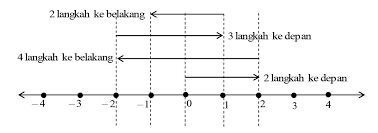
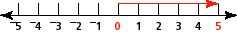
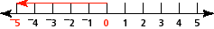

# Fungsi Bawaan

Fungi bawaan atau yang biasa disebut dengan *build-in functions* adalah **beberapa fungsi-fungsi tambahan yang dibuat oleh kontributor *Python* dan disediakan untuk kita gunakan secara gratis**. Fungsi-fungsi ini sudah tersedia saat kita melakukan instalasi *Python*. Beberapa bahkan sudah pernah kita gunakan sebelumnya. Misalnya `len()` untuk mencari tahu seberapa panjang sebuah *string* atau *list*, `print()` untuk menampilkan ke layar, dan masih banyak lagi.

Berikut beberapa *build-in function* menarik yang disediakan *Python*. Kita akan membahas sedikit dari sekian banyak *build-in function* yang ada. Untuk melihat seluruh *build-in function* yang disediakan *Python* silakan ke [tautan berikut](https://docs.python.org/3/library/functions.html).

Ikuti beberapa latihan di bawah ini untuk mengetahui *build-in function* yang biasa digunakan.

## Nilai Absolut atau Nilai Mutlak

Pertama kita akan membahas tentang `abs()` yang akan **menghasilkan nilai absolut atau mutlak dari sebuah angka**.

Nilai absolut atau mutlak yaitu nilai suatu bilangan riil tanpa tanda plus atau minus. Cara mengetahuinya sebagai berikut:



Nilai absolut dari `5` adalah `5` **(jarak dari 0 yaitu 5 unit)**, Nilai mutlak dari `-5` adalah `5` `(jarak dari 0: 5 unit)`. Perhatikan gambar di bawah ini:





Dalam bahasa pemrograman *Python* kita bisa menggunakan fungsi bawaan seperti berikut:

```py
# contoh 1
nilai = -5
print('Nilai absolut dari variabel nilai adalah:', abs(nilai)) # Nilai absolut dari variabel nilai adalah: 5

# contoh 2
nilai = -94.3
print('Nilai absolut dari variabel nilai adalah:', abs(nilai)) # Nilai absolut dari variabel nilai adalah: 94.3
```

## Mengetahui Tipe Data atau Struktur Data

Kemudian ada juga `isinstance()` yang dapat digunakan untuk **mencari tahu tipe data atau struktur data** dari sebuah variabel.

```py
numbers = [1, 2, 3]
print(isinstance(numbers, list)) # is [1, 2, 3] a list? True
print(isinstance(numbers, dict)) # is [1, 2, 3] a dict? False
print(isinstance(numbers, ( dict, list ))) # is [1, 2, 3] a dict or a list? True

number = 22
print(isinstance(number, list)) # False
print(isinstance(number, int)) # True
```
