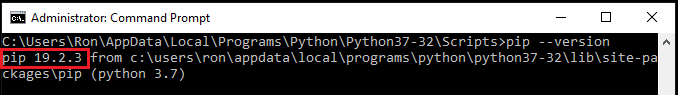
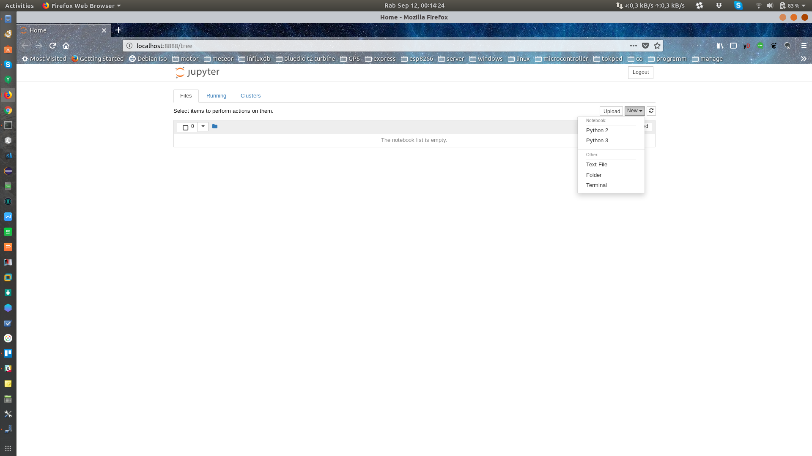
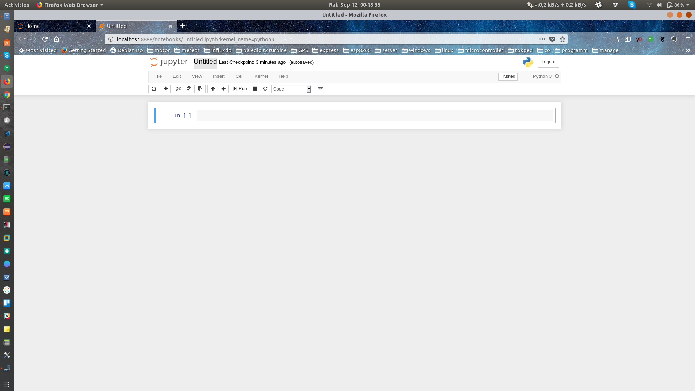
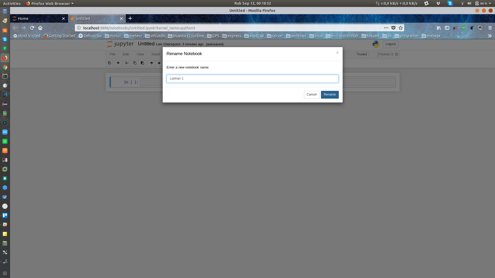
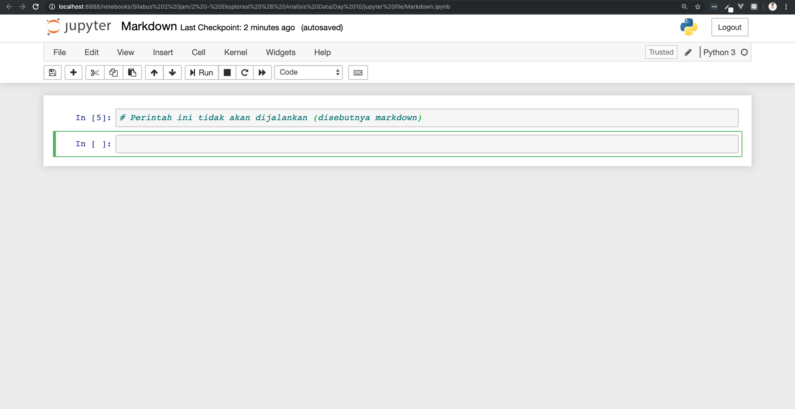
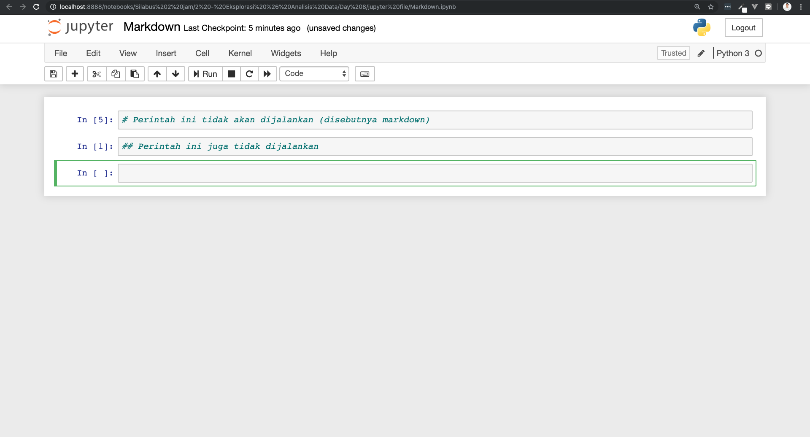
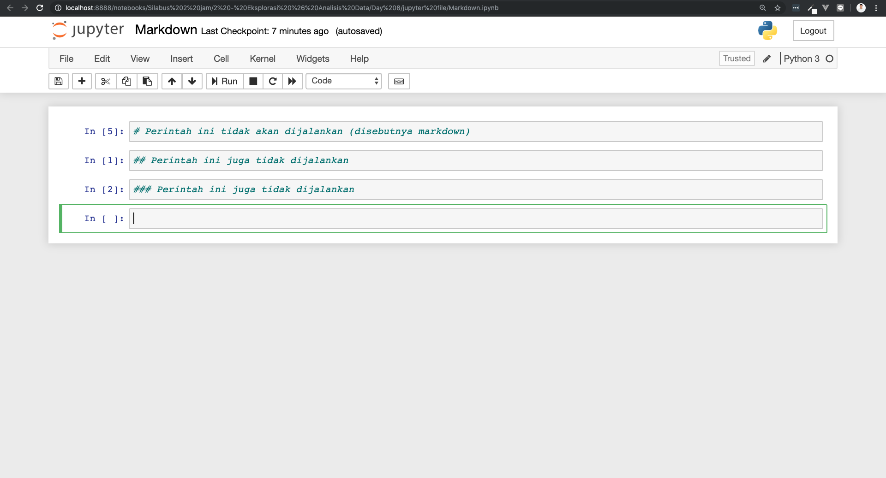
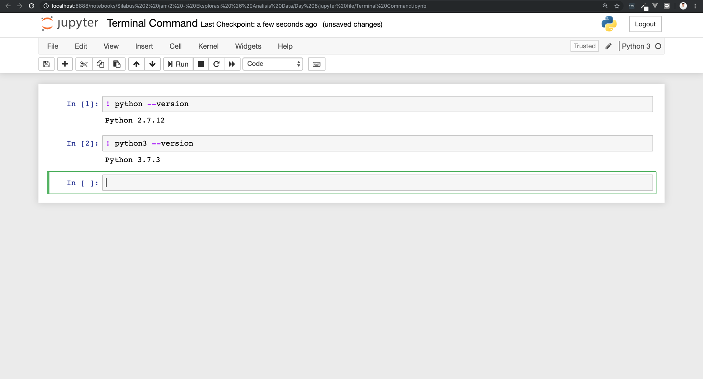
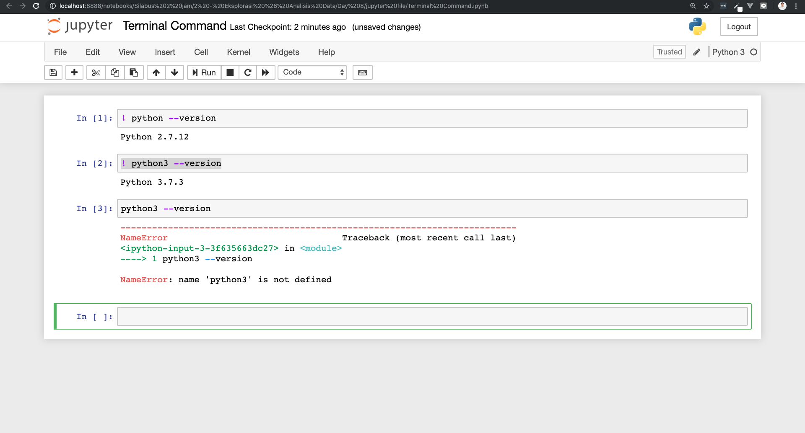

# Jupyter Notebook

Salah satu alasan menginstal anaconda adalah *Jupyter* sudah ada di dalamnya. *Jupyter Notebook* lebih di kenal dengan sebutan *Jupyter* saja. *Jupyter* merupakan pengembangan dari *IPython*, *IPython* disini bertindak sebagai *kernel* (sistem yang mengelola pemrosesan *Jupyter* di belakang layar) dan *Jupyter* menggunakan antarmuka *Notebook Interface* (sebutan untuk tampilan *Jupyter*) lebih mirip dokumen interaktif yang bisa mengerjakan banyak hal.

*Jupyter* ini boleh dibilang lokal *editor* dalam bentuk aplikasi *web* yang berjalan di *browser* kita yang memiliki kemampuan untuk merubah blok kode menjadi teks yang mudah dibaca. *Jupyter* juga biasa digunakan untuk menulis kode *Python* dan bahasa pemrograman lainnya, *equations* (rumus), visualisasi, dan bisa juga sebagai *markdown* *editor* (*file* dengan ekstension `.md` seperti *file* ini). Kita juga bisa menampilkan gambar dan video menggunakan *Jupyter*. Dan terakhir *Jupyter* juga bisa dieksport menjadi pdf.

## Instalasi Jupyter Notebook

Buat teman-teman yang sudah menginstal anaconda bisa *skip* bagian ini, karena *Jupyter* sudah otomatis ikut terinstal ketika kita menginstal anaconda. Tetapi jika teman-teman mau menjalankannya pastikan sudah melakukan [*set path Python*](https://codesaya.com/a/tutorial-installasi-python-pada-windows-wxcjqmvyvm/) terlebih dahulu. Sekarang kita akan mulai instalasi *Jupyter* menggunakan `pip`.

1. Pertama, pastikan kita sudah menginstal *Python* di komputer.
2. Ke dua, pastikan `pip` ikut terinstal ketika kita menginstal *Python* dengan mengecek versinya (di *wondows*) seperti berikut:

    ```py
    pip --version
    ```

    Jika berhasil hasilnya akan seperti berikut:

    

    `pip 19.2.3` akan mengikuti versi dari *pip* yang ada di komputer teman-teman.

3. Sekarang kita tinggal mengetikkan sintak berikut untuk menginstal *Jupyter*

    ```py
    pip install jupyter
    ```

## Menjalankan Jupyter Notebook

Menjalankan *Jupyter* bisa menggunakan dua cara,

1. Pertama, kita bisa **mengklik *icon* *Jupyter* di anaconda** yang bisa kita temui di bagian *start menu* *(windows)*
2. Ke dua, kita bisa mengarahkan ke folder tempat di mana nantinya kita menyimpan *file* *Jupyter* kita, selanjutnya di terminal (cmd di *windows*) tinggal kita ketikkan `jupyter notebook`

Jika mau menjalankannya di *port* yang berbeda dari *port* *default*-nya *Jupyter*, kita bisa mengetikkan `jupyter notebook --port 7777` di terminal. Sintak barusan akan menjalankan *Jupyter* di *localhost port* 7777.

## Menghentikan Jupyter Notebook

Menghentikan *Jupyter* bisa menggunakan dua cara,

1. Pertama, pilih *File > Close and Halt*
2. Ke dua, *Jupyter* punya tab namanya *running*. Di sana terdapat kernel *Jupyter* yang masih aktif dan dapat kita hentikan dengan cara mengklik *shutdown button* yang ada di sana.

## Menggunakan Jupyter untuk Pertama Kali

Untuk menambahkan *notebook* atau *file* baru, kita hanya perlu mengklik tombol *new* lalu akan muncul pilihan versi *Python*. Pilihan versi *Python* ini akan sesuai dengan *Python* yang ter-*install* di laptop kita. Jika kita hanya memiliki 1 versi *Python* maka hanya akan muncul 1 saja.



Kita sekarang akan menggunakan *Python* versi 3. Setelah diklik maka *Jupyter* akan membuka *tab* baru di *browser* yang sama. Untuk mengganti nama *notebook*, kita tinggal klik pada nama *notebook*-nya yang tulisannya masih *untitled*. Kemudian akan muncul *popup* untuk konfirmasi mengganti nama *notebook* setelah kita mengetikkan nama yang kita inginkan, selanjutnya kita hanya tinggal klik *rename* *button*.





Seperti yang kita lihat, kita hanya memiliki 1 *cell*. Dan di *cell* inilah kita dapat menuliskan kode yang kita inginkan. Karena kita menggunakan *Python* versi 3, maka kita coba mengetikkan perintah `print("Hello world")`. Setelah itu coba klik *run*.


Maka hasil dari perintah yang kita ketikkan akan muncul tepat dibawah *cell*-nya. Untuk menambah *cell* baru kita hanya perlu mengklik `+` *button*.

## Membuat Markdown

Seperti yang telah kita singgung sebelumnya. Pada *notebook* ini kita juga bisa membuat *markdown* atau **baris yang tidak akan dibaca sebagai kode**, sehingga kita bisa menambahkan komentar pada baris tersebut.

Jika kita tambahkan tanda `#` pada baris dan lihat apa yang terjadi.



Kemudian coba tambahkan lagi tanda `#`, sehingga menjadi 2 tanda `#` di depan baris.



Bisa juga begini `### Example command`.



## Eksekusi Sintaks Terminal / CMD di Jupyter

Kita bisa menambahkan tanda `!` di depan *cell* untuk menjalankan perintah *command line* atau *terminal*. Contohnya `! python --version`. Dia akan mengembalikan versi dari *Python* yang ada di komputer kita.



Kita bisa menggunakan *notebook* ini sebagai *file* *Python* pada umumnya, seperti bisa menjalankan perintah beberapa baris.

Begitu pula penggunaan variabel dan fungsi.

Namun, dengan *notebook* ini, kita bisa melakukan *debugging* (memeriksa kode baris perbaris, biasanya untuk menemukan *error*) pada kode yang kita punya ditiap barisnya sehingga memudahkan kita ketika ada *error* pada kode yang kita buat.



Perintah pada *cell* ke-3 *error* karena kurang tanda `!` di awal barisnya.
