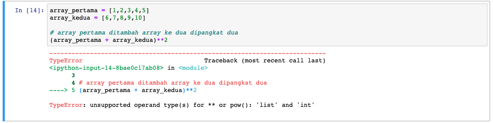
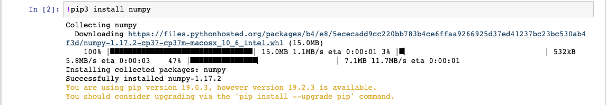

# Numpy

Kita pernah belajar tentang tipe data untuk menampung himpunan yang ada di *Python*, salah satunya adalah `list`. `list` merupakan struktur data yang dapat menyimpan daftar dari berbagai *value*, bisa menyimpan berbagai jenis tipe data, sebuah struktur data yang sangat *powerful* serta isinya dapat kita ganti, tambahkan, hapus, dsb.

Akan tetapi untuk keperluan *data science* ternyata `list` masih kurang *powerful*. Kenapa dikatakan begitu? Contohnya, apabila kita ingin melakukan operasi matematika di dalam sebuah `list`, kita harus melakukan iterasi untuk mengeluarkan *value*-nya satu-per-satu. Untuk data yang jumlahnya sedikit mungkin tidak akan terlalu banyak masalah. Bagaimana jika kita memiliki ribuan bahkan jutaan data sekaligus? Tentu kode yang kita jalankan akan menjadi sangat lemot. Perlu diketahui, ketika kita memasuki dunia *data science*, kita akan berhadapan dengan ribuan hingga jutaan data sekaligus.

Untuk memproses data yang jumlahnya besar, `list` akan menjadi lambat dan tidak lagi fleksibel. Karena itu kita membutuhkan *library* tambahan, yaitu [NumPy](https://numpy.org) untuk menangani pemrosesan data yang sangat banyak.

*NumPy* atau *Numeric Python* adalah sebuah *library* yang memang didesain untuk menangani komputasi yang banyak dan kompleks. Memproses data dalam jumlah banyak tidak masalah untuk *NumPy*. Karena *NumPy* mudah digunakan dan cepat dalam eksekusinya, bahkan dengan ukuran data yang terbilang besar sekalipun.

> Selanjutnya kita akan mengganti kalimat `list` menjadi *array* yang sudah familiar di bahasa pemrograman lainnya.

Perhatikan contoh berikut:

```py
array_pertama = [1,2,3,4,5]
array_kedua = [6,7,8,9,10]

# array pertama ditambah array ke dua dipangkat dua
(array_pertama + array_kedua)**2
```

Eksekusi via *jupyter notebook:*



Yup, kalau kode di atas dijalankan maka akan terjadi *error*. *Error* tersebut disebabkan karena, ketika kita mau melakukan operasi di atas menggunakan dua buah *array* yang berbeda, maka kita harus melakukan perulangan tradisional seperti `while` atau `for` di setiap *array* tersebut. Nah, menggunakan *NumpPy* kita bisa membaca seluruh isi *array* dengan cepat tanpa harus melakukan perulangan tradisional.

## Instalasi NumPy

Selama pembahasan *NumPy* kita akan selalu menggunakan *jupyter notebook* pada saat penulisan kode *Python*-nya. Untuk itu, kita install *NumPy* menggunakan *jupyter notebook* terlebih dahulu. Untuk menginstalnya kita membutuhkan koneksi internet. Selanjutnya, teman-teman perlu membuka *jupyter notebook* dan mengetikkan perintah berikut:

```jupyter notebook
!pip install numpy
```

Tampilannya instalasinya seperti ini:



Selanjutnya kita bisa meng-*import* *NumPy* dan tambahkan alias `np` agar lebih gampang digunakan seperti berikut:

```jupyter notebook
import numpy as np
```

*Jupyter notebook:*


