# Multidimensi Array dengan numpy

## Array menggunakan numpy

Kita coba contoh sebelumnya yang *error* menggunakan *numpy*:

Tanpa menggunakan *numpy:*

```py
# list
array_pertama = [1,2,3,4,5]
array_kedua = [6,7,8,9,10]

# array pertama ditambah array ke dua dipangkat dua
(array_pertama + array_kedua)**2
```

*Jupyter notebook:*


Menggunakan *numpy:*

> Jangan lupa import NumPy terlebih dahulu (`import numpy as np`)

```py
# numpy array
array_pertama = np.array([1,2,3,4,5])
array_kedua = np.array([6,7,8,9,10])

# array pertama ditambah array ke dua dipangkat dua
(array_pertama + array_kedua)**2
```

*Jupyter notebook:*

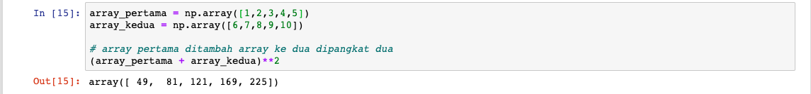

Pada kode di atas, ketika kita mendefinisikan *array* baru menggunakan format `np.array([])` atau yang biasa disebut juga dengan *numpy array*.

- `np` adalah alias untuk *numpy*
- `array()` adalah *method* standar yang disediakan oleh *numpy* untuk memanipulasi *array*.

### Cara lain penulisan Numpy Array

Kita juga bisa pisah penulisan *numpy array* seperti ini:

```py
isi_list = [2,3,5,1,9] # variabel
np.array(isi_list) # numpy array
```

*Jupyter notebook:*

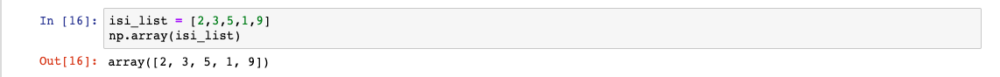

### Tipe Data Numpy Array

Berbeda dengan `list`, ***numpy array* hanya boleh mengandung satu jenis tipe data saja**. Misalnya `array_pertama` dan `array_kedua` di atas hanya boleh mengandung tipe data *integer* saja.

Jika kita memaksakan untuk memasukkan tipe data yang berbeda ke dalam *numpy array*, secara otomatis *numpy* akan melakukan konversi sehingga tipe datanya menjadi sama. Mari kita coba.

```py
mixed_array = np.array([1.0, "is", True])
print(mixed_array)
```

*Jupyter notebook:*

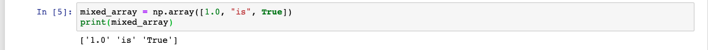

Hasilnya tipe data *integer* dan *boolean* di atas akan ikut berubah menjadi *string*.

### Rubah Tipe Data Numpy Array

Kita juga bisa mengatur tipe data dari *array* yang kita punya. Kita bisa menggunakan `dtype= *tipe data*`. Ada beberapa versi konversi tipe data yang sering digunakan:

1. *Integer* menggunakan `np.int`
2. *Float* menggunakan `np.float`
3. *String* menggunakan `np.str`

```py
contoh_array = np.array([1.39,2.55,3], dtype=np.int)
contoh_array
```

*Jupyter notebook:*

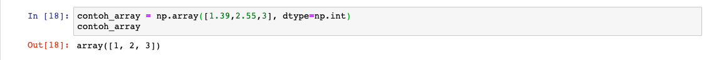

`dtype=np.int` ketika dijalankan, kita menkonversi bilangan desimal (tipe data *float*) ke tipe data *integer.*

### Custom Array

Untuk membuat *custom array, numpy* menyediakan fungsi `arange()`. Ada dua cara penggunaannya:

1. Jika hanya **diisi dengan satu parameter** seperti `arange(6)` maka akan menghasilkan *array* dengan rentang nilai `0-5`.

2. Ada juga dengan **format tiga parameter**, yaitu `arange(indeks_awal,indeks_akhir,kelipatan)`.

Contoh pengunaannya adalah:

```py
# isi satu parameter
np.arange(6) # 0,1,2,3,4,5

# isi tiga parameter
array_arange = np.arange(2,20,2)
array_arange # array([ 2,  4,  6,  8, 10, 12, 14, 16, 18])
```

*Jupyter notebook:*

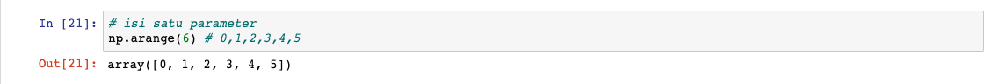
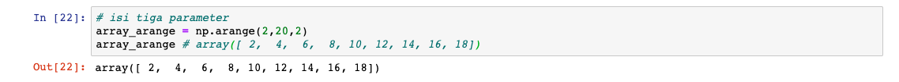

## Array Dua Dimensi

Kalau biasanya kita hanya membuat *array* yang berisi satu baris saja, sekarang kita akan mencoba membuat 2 baris *array* atau yang biasa disebut dengan *array* dua dimensi. Biar lebih kebayang bentuknya adalah sebagai berikut:

1. 1D

    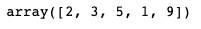

2. 2D

    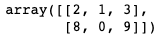

3. 5D

    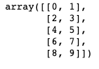

### Membuat Array 2D

Berikut adalah contoh membuat *array 2D* menggunakan *numpy*:

```py
array_2d = np.array([(2,1,3),(8,0,9)]) # perhatikan penggunaan parenthesis-nya
array_2d
```

*Jupyter notebook:*

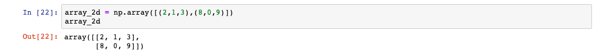

Jika diperhatikan *array* dimulai dan ditutup dengan `()` *(pharentesis)*. *Array* dimensi pertama dan dimensi ke dua dipisahkan oleh tanda koma (`,`).

### Melihat Dimensi Array

*Numpy* menyediakan fungsi `shape` untuk melihat dimensi dari sebuah *array*:

```py
array_2d.shape # (2,3) artinya 2 baris dan 3 kolom
```

*Jupyter notebook:*

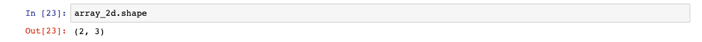

### Membuat Dimensi Array

Kita bisa membuat suatu *array* baru kemudian membuat dimensinya menggunakan fungsi `reshape(baris,kolom)`:

```py
array = np.arange(10).reshape(5,2) # pastikan (baris, kolom) jika dikalikan menghasilkan parameter arange()
array
```

*Jupyter notebook:*

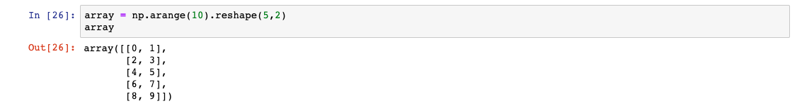

## Matriks

Masih ingat *matriks?* Matriks adalah sekumpulan bilangan yang disusun secara baris dan kolom dan ditempatkan pada kurung biasa atau kurung siku. Biar lebih kebayang bentuknya adalah sebagai berikut:

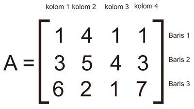

> *Array* 2 dimensi atau lebih biasanya juga disebut dengan matriks.

### Zeros Function

Kita bisa membuat suatu matriks dengan isian seluruhnya `0`, menggunakan *method* `zeros()`:

```py
matriks = np.zeros([3,4]) # 3 adalah baris, 4 adalah kolom
matriks
```

*Jupyter notebook:*

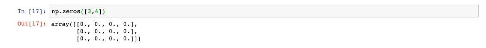

### Ones Function

Kebalikan dari fungsi `zeros()` adalah fungsi `ones()`:

```py
matriks = np.ones([3,4]) # membuat semua array dengan isian 1
matriks
```

*Jupyter notebook:*

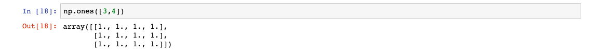

### Eye Function

*Numpy* juga menyediakan cara membuat matriks yang di dalamnya terdapat angka `0` dan `1` secara diagonal, menggunakan *method* `eye()`. Matriks diagonal ini nantinya akan kita bahas kegunaannya lebih lanjut pada *machine learning*:

```py
array_eye = np.eye(3) # 3 berarti 3x3 matriks atau 3x3 array
array_eye
```

*Jupyter notebook:*

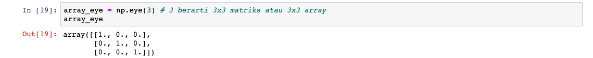
